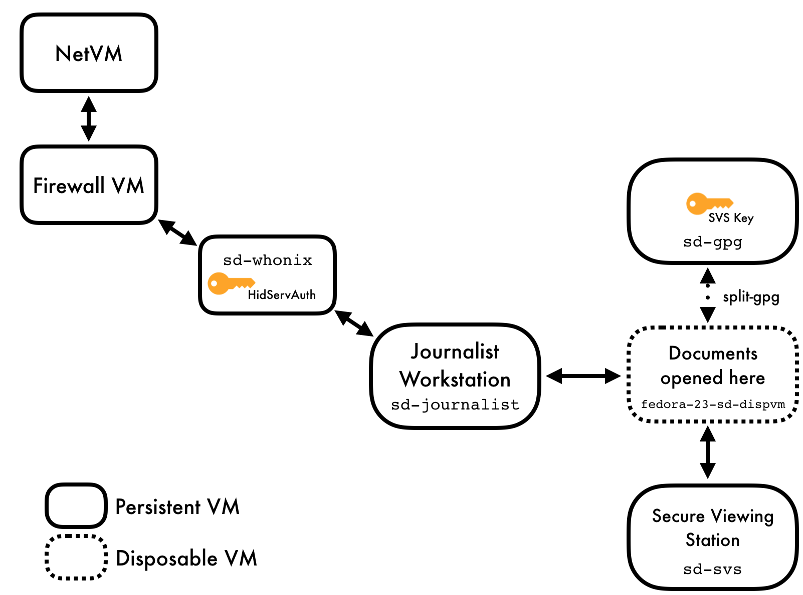

## Bringing SecureDrop to Qubes

This project aims to make journalists' experience working with SecureDrop less onerous while retaining the current security and privacy features SecureDrop provides. We're doing that by moving the set of journalist-facing tools, which currently spans multiple Tails installations and requires physical USB drives to move data, to a single computer running mulitple virtual machines, with data moved as automatically and transparently as possible between otherwise-isolated VMs.

### Architecture

The current architecture replaces the `Journalist Workstation` and `Secure Viewing Station` Tails installations with specially-configured Qubes VMs; these are the VMs the user will primarily interact with. There are a number of other configured VMs which provide ancillary services.

Currently, the following VMs are provisioned:

- `sd-journalist` is used for accessing the journalist Tor hidden service. It uses `sd-whonix` as its network gateway. The submission processing workflow is triggered from this VM as submissions are downloaded.
- `sd-svs` is a non-networked VM used to store and explore submissions after they're unarchived and decrypted. Any files double-clicked in this VM are opened in a disposable VM.
- `sd-whonix` is the Tor gateway used to contact the journalist Tor hidden service. It's configured with the auth key for the hidden service. The default Qubes Whonix workstation uses the non-SecureDrop Whonix gateway, and thus won't be able to access the `Journalist Interface`.
- `sd-gpg` is a Qubes split-gpg AppVM, used to hold submission decryption keys and do the actual submission crypto.
- Qubes' `dispvm` is configured both to decrypt incoming submissions (utilizing `sd-gpg`) and to open all files for the `sd-svs` VM.

Submissions are processed in the following steps:

1. Journalist uses the Tor Browser in the `sd-journalist` VM to visit the authenticated Tor hidden service Journalist Interface. After logging in, the journalist clicks on any submission they're interested in.
2. The Tor Browser in the `sd-journalist` VM offers to open the submission with the configured handler (`sd-process-download`)
3. The `sd-process-download` script, run by Tor Browser, moves the submission to a disposable VM
4. On the disposable VM, the submission is unarchvied and decrypted using Qubes' split-GPG functionality (decryption is done in a trusted, isolated VM, keeping GPG keys off of the system-wide DispVM).
5. The decrypted submission is copied to the `sd-svs` Secure Viewing Station VM, where it's placed in the `Sources` directory based on the source name.
6. Any file viewed in the Secure Viewing Station is opened in a Disposable VM, largely mitigating attacks from malicious content.

See below for a closer examination of this process.

### What's in this repo?

This project can be broken neatly into two parts: a set of salt states and `top` files which configure the various VMs, and scripts and system configuration files which set up the document handling process.

Qubes uses SaltStack internally for VM provisionining and configuration management (see https://www.qubes-os.org/doc/salt/), so it's natural for us to it as well. The `dom0` directory contains salt `.top` and `.sls` files used to provision the VMs noted above.

`sd-journalist` contains scripts and configuration which will be placed on the sd-journalist VM. In particular, two scripts to initiate the handling of new submissions exists in this directory:

- `move-to-svs` will explore all files in Tor Browser's Downloads directory, and attempt to process them all. This script is run by hand, and shouldn't be necessary in day-to-day use.
- `sd-process-download` is configured as the VM's `application/zip` mime type handler, so Tor Browser will by default open SD submissions with this script

`sd-svs` contains scripts and configuration for the viewing station VM. These include a script to handle incoming, decrypted files during the submission handling process, and desktop configuration files to make this VM open all files in a disposable VM.

`decrypt` contains scripts for the VMs handing decryption. These get used both while configuring the systemwide disposable VM, and when provisioning the `sd-gpg` split GPG VM. These should probably be separated into two directories- one for `sd-gpg` and one for the disposable VM config.

`config.json.orig` is an example config file for the provisioning process. Before use, you should copy it to `config.json`, and adjust to reflect your environment.

`Makefile` is used with the `make` command on dom0 to build the Qubes/SecureDrop installation, and also contains some development and testing features

### Using this repo

What follows describes how to configure and use this repo for development and testing. We don't yet have a full story for production deployment- see #17 for discussion about that.

First install Qubes 3.2 and accept the default VM configuration during the install process.

Next, some SecureDrop-specific configuration: edit `config.json` to include your values for the Journalist hidden service `.onion` hostname and PSK. Replace `sd-journalist.sec` with the GPG private key used to encrypt submissions. Edit `Makefile` and replace `DEVVM` and `DEVDIR` to reflect the VM and directory to which you've cloned this repo. Note that `DEVDIR` must not include a trailing slash.

Qubes provisioning is handled by Salt on `dom0`, so this project must be copied there from your development VM. That process is a little tricky, but here's one way to do it: assuming this code is checked out in your `work` VM at `/home/user/projects/securedrop-workstation`, run the following in `dom0`.

    qvm-run --pass-io work 'tar -c -C /home/user/projects securedrop-workstation' | tar xvf -

After that initial manual step, the code in your development VM may be copied into place on `dom0` by running `make clone` on from the root of the project on `dom0`.

Once the configuration is done and this directory is copied to `dom0`, `make` can be used to handle all provisioning and configuration by your unprivledged user:

    $ cd securedrop-workstation
    $ make all

### Development

My development workflow is different depending on if I'm working on provisioning components or submission-handling scripts.

For developing salt states and other provisioning component, I work in a development VM and make changes to individual state and top files there. Then, in the `dom0` copy of this project, I'll `make clone` to copy over the updated files, then use `make <vm-name>` to rebuilt an individual VM, or `make all` to rebuild the full installation. Current valid target VM names are `sd-journalist`, `sd-gpg`, `sd-whonix`, `disp-vm`.

For developing submission processing scripts I often work directly in the virtual machine running the component I'm working on. When I'm at a good checkpoint, I'll copy the updated files to my work VM with `qvm-copy-to-vm ...`, move the copied files into place in the repo, and commit the changes there. This process is a little awkward, and it would be nice to make it better.

### Testing

Tests should cover two broad domains. First, we should assert that all the expected VMs exist and are configured as we expect (with the correct NetVM, with the expected files in the correct place). Second, we should end-to-end test the document handlng scripts, asserting that files present in the sd-journalist VM correctly make their way to the sd-svs AppVM, and are opened correctly in disposable VMs.

Tests can be found in the `tests/` directory. They use Python's `unittest` library, and so can be run from the project's root directory on `dom0` with:

    make test

Individual tests can be run with `make <test-name>`, where `test-name` is one of `test-svs`, `test-journalist`, `test-whonix`, or `test-disp`.

Be aware that running tests *will power down running SecureDrop VMs, and may result in data loss*. Only run tests in a development / testing environment.
