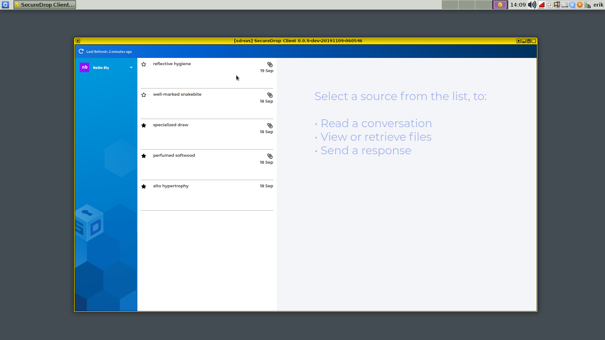

[](https://gitter.im/freedomofpress/securedrop?utm_source=badge&utm_medium=badge&utm_campaign=pr-badge)


## Bringing SecureDrop to Qubes

This project aims to improve journalists' experience working with SecureDrop while retaining the current security and privacy features SecureDrop provides. The journalist tools currently span multiple machines and require data to be moved using physical USB drives. We are re-designing this cumbersome process by moving the journalist workflow to a single computer running multiple virtual machines with [Qubes OS](https://qubes-os.org). Data is moved as automatically and transparently as possible between otherwise isolated VMs.

## Contents

1. [Detailed Rationale](#detailed-rationale)
2. [Architecture](#architecture)
3. [What's In This Repo?](#whats-in-this-repo)
2. [Installation](#installation)
   - [Install Qubes](#install-qubes)
   - [Development Environment](#development-environment)
   - [Production and Staging Environments](#production-and-staging-environments)
3. [Development](#development)
   - [Testing](#testing)
   - [Automatic Updates](#automatic-updates)
   - [Building the Templates](#building-the-templates)
   - [Building workstation deb packages](#building-workstation-deb-packages)
   - [Building workstation rpm packages](#building-workstation-deb-packages)
4. [Using the *SecureDrop Client*](#using-the-securedrop-client)
   - [Signing in](#signing-in)
   - [Viewing messages and documents](#viewing-messages-and-documents)
   - [Exporting documents](#exporting-documents)
   - [Manual export flow](#manual-export-flow)
   - [Automated export flows](#automated-export-flows)
   - [Transferring files via OnionShare](#transferring-files-via-onionshare)
   - [Printing](#printing)
5. [Distributing and Releasing](#distributing-and-releasing)
6. [Threat model](#threat-model)

## Detailed Rationale

SecureDrop's [architecture](https://docs.securedrop.org/en/latest/overview.html#infrastructure) and [threat model](https://docs.securedrop.org/en/stable/threat_model/threat_model.html) are proven, but the current approach also has major drawbacks:

- Journalists must access a separate, airgapped device to even validate that a submission is relevant. The airgapped workflow is complex and slow, and may reduce the reliance on SecureDrop overall.

- The complexity of the setup and the usage procedures create operational security risks. For example, journalists may accidentally boot up the wrong device using the _Secure Viewing Station_ (SVS) USB drive, breaking the airgap, or they may attempt "workarounds" to shortcut the laborious process of checking for submissions.

- Applying security updates to the SVS is difficult, which may cause administrators to wait a long time before doing so. While the SVS is airgapped, an insecure SVS still exposes additional vectors of attack, especially since the journalist is by design opening unknown files on the workstation.

- Once a document has been decrypted on the SVS, a journalist is more or less on their own right now. Work on the submission and the collaboration with other journalists are "not our department". Yet, security failures are likely during this stage. It's difficult to address this fundamental issue with the current workflow, since the SVS is essentially a dead end as far as SecureDrop is concerned.

The Qubes OS approach addresses this at multiple levels:

- By disabling Internet access and [mitigating against other exfiltration risks](https://en.wikipedia.org/wiki/Air_gap_malware) on a per-VM basis, we can combine multiple functions into a single device. Checking SecureDrop submissions is as simple as booting up your workstation, downloading recent submissions, and inspecting them. This has the potential to greatly reduce time and effort spent by SecureDrop journalists, administators and trainers, and to increase day-to-day SecureDrop use.

- Qubes OS' security model lets us add specific software features (such as redaction of documents) with careful consideration in each case what level of system or network access an application requires. This lets us gradually extend the functionality we can offer to journalists beyond the mere download of submissions.

- We can potentially add VMs that enable end-to-end encrypted communication with other SecureDrop journalists, intermediated by the SecureDrop server. This enables us to add software features that, for example, let journalists collaborate in categorizing submissions, assigning work, versioning changes to documents, and so on.

However, the Qubes OS approach is not without downsides. It stands and falls with the security of Qubes OS itself, which in turn may be impacted by Spectre/Meltdown type CPU level vulnerabilities, hypervisor vulnerabilities, and so on. These risks must be compared against the operational security risks of the current architecture, including the work that journalists do after downloading a submission. The Qubes OS website provides a useful [comparison of its security model with that of using a separate machine](https://www.qubes-os.org/intro/#how-does-qubes-os-compare-to-using-a-separate-physical-machine).

While we are strongly committed to piloting the use of Qubes OS for SecureDrop, no final decision has been made to move to this new architecture. This decision will require a full audit of this new approach, consideration of alternatives, and extensive validation with SecureDrop's current user community.

## Architecture

The current architecture replaces the *Journalist Workstation* and *Secure Viewing Station* Tails installations with specially-configured Qubes VMs; these are the VMs the user will primarily interact with. There are a number of other configured VMs which provide ancillary services.


Currently, the following VMs are provisioned:

- `sd-proxy` is where the SecureDrop proxy resides, which allows the non-networked `sd-app` vm to communicate with the *Journalist Interface* over Tor.
- `sd-app` is a non-networked VM in which the *SecureDrop Client* runs used to store and explore submissions after they're unarchived and decrypted. Any files opened in this VM are opened in a disposable VM.
- `sd-whonix` is the Tor gateway used to contact the journalist Tor hidden service. It's configured with the auth key for the hidden service. The default Qubes Whonix workstation uses the non-SecureDrop Whonix gateway, and thus won't be able to access the *Journalist Interface*.
- `sd-gpg` is a Qubes split-gpg AppVM, used to hold submission decryption keys and do the actual submission crypto.
- `sd-dispvm` is an AppVM used as the template for the disposable VMs used for processing and opening files.
- `sd-log` is an AppVM used for centralized logging - logs will appear in `~/QubesIncomingLogs` from each AppVM using the centralized logging service.

Submissions are processed in the following steps:

1. Journalist uses the *SecureDrop Client* to access the *Journalist Interface* via the Journalist API. After logging in, the journalist clicks
on any submission of interest.
2. The *SecureDrop Client* will use `sd-gpg` to decrypt the submission using Qubes' split-GPG functionality (decryption is done in a trusted, isolated VM, keeping GPG keys off of the system-wide DispVM).
5. The decrypted submission is stored on the `sd-app` *Secure Viewing Station VM*, where it's placed in a local database.
6. Any file opened by the *SecureDrop Client* in the *Secure Viewing Station VM* is opened in a Disposable VM, largely mitigating attacks from malicious content.

See below for a closer examination of this process, and see `docs/images` for screenshots related to the steps above.

## What's In This Repo?

This project can be broken neatly into two parts: 1) a set of salt states and `top` files which configure the various VMs, and 2) scripts and system configuration files which set up the document handling process.

Qubes uses SaltStack internally for VM provisionining and configuration management (see https://www.qubes-os.org/doc/salt/), so it's natural for us to use it as well. The `dom0` directory contains salt `.top` and `.sls` files used to provision the VMs noted above.
- `Makefile` is used with the `make` command on `dom0` to build the Qubes/SecureDrop installation, and also contains some development and testing features.
- The [SecureDrop Client](https://github.com/freedomofpress/securedrop-client) is installed in `sd-app` and will be used to access the SecureDrop server *Journalist Interface* via the SecureDrop proxy.
- The [SecureDrop Proxy](https://github.com/freedomofpress/securedrop-proxy) is installed in `sd-proxy` to communicate to the SecureDrop server *Journalist Interface* via `sd-whonix`.
- Within `sd-app`, the *SecureDrop Client* will open all submissions in the `sd-viewer` disposable VM.
- `config.json.example` is an example config file for the provisioning process. Before use, you should copy it to `config.json`, and adjust to reflect your environment.
- `sd-journalist.sec.example` is an example GPG private key for use in decrypting submissions. It must match the public key set on a SecureDrop server used for testing. Before use, you should copy it to `sd-journalist.sec`, or store the submission key used with your SecureDrop server as `sd-journalist.sec`.

## Installation

Installing this project is involved. It requires an up-to-date Qubes 4.0 installation running on a machine with at least 12GB of RAM. You'll need access to a SecureDrop staging server as well.

### Install Qubes

Before trying to use this project, install [Qubes 4.0.3](https://www.qubes-os.org/downloads/) on your development machine. Accept the default VM configuration during the install process.

After installing Qubes, you must update both dom0 and the base templates to include the latest versions of apt packages. Open a terminal in `dom0` by clicking on the Qubes menu top-right of the screen and left-clicking on Terminal Emulator and run:

```
sudo qubes-dom0-update
```
After dom0 updates complete, reboot your computer to ensure the updates have been properly applied. Finally, update all existing TemplateVMs:

```
qubes-update-gui
```

Select all VMs marked as **updates available**, then click **Next**. Once all updates have been applied, you're ready to proceed.

### Development Environment

#### Download, Configure, Copy to `dom0`

Decide on a VM to use for development. We suggest creating a standalone VM called `sd-dev`. Clone this repo to your preferred location on that VM.

Next we need to do some SecureDrop-specific configuration:

- Create a `config.json` file based on `config.json.example` and include your values for the hidserv fields: `hostname` (the Journalist Interface Onion URL) and `key` (the fingerprint for the SecureDrop Submission key). To find the Journalist Interface Onion URL, you can run `sudo cat /var/lib/tor/services/journalist/hostname` on your server. The values for `hostname` and `key` in `config.json.example` are set to the default values for the SecureDrop staging instance.

- Create an `sd-journalist.sec` file in the root directory with the ASCII-armored GPG private key used to encrypt submissions in your test SecureDrop instance. The included key `sd-journalist.sec` is the one used by default in the SecureDrop staging instance.

Qubes provisioning is handled by Salt on `dom0`, so this project must be copied there from your development VM.

*Understand that [copying data to dom0](https://www.qubes-os.org/doc/copy-from-dom0/#copying-to-dom0) goes against the grain of the Qubes security philosophy, and should only done with trusted code and for very specific purposes, such as Qubes-related development tasks. Still, be aware of the risks, especially if you rely on your Qubes installation for other sensitive work.*

That process is a little tricky, but here's one way to do it: assuming this code is checked out in your `sd-dev` VM at `/home/user/projects/securedrop-workstation`, run the following in `dom0`:

    qvm-run --pass-io sd-dev 'tar -c -C /home/user/projects/ securedrop-workstation' | tar xvf -

(Be sure to include the space after `/home/user/projects/`.)
After that initial manual step, the code in your development VM may be copied into place on `dom0` by setting the `SECUREDROP_DEV_VM` and `SECUREDROP_DEV_DIR` environmental variables to reflect the VM and directory to which you've cloned this repo, and running `make clone` from the root of the project on `dom0`:

```
[dom0]$ export SECUREDROP_DEV_VM=sd-dev    # set to your dev VM
[dom0]$ export SECUREDROP_DEV_DIR=/home/user/projects/securedrop-workstation    # set to your working directory
[dom0]$ cd ~/securedrop-workstation/
[dom0]$ make clone    # copy repo to dom0
```

If you plan to work on the [SecureDrop Client](https://github.com/freedomofpress/securedrop-client) code, also run this command in `dom0`:

```
qvm-tags sd-dev add sd-client
```

Doing so will permit the `sd-dev` AppVM to make RPC calls with the same privileges as the `sd-app` AppVM.

**NOTE:** The destination directory on `dom0` is not customizable; it must be `securedrop-workstation` in your home directory.

#### Provision the VMs

Before provisioning the VMs, ensure your `environment` key is set to `dev` in `config.json`.
Once the configuration is done and this directory is copied to `dom0`, you must update existing Qubes templates and use `make` to handle all provisioning and configuration by your unprivileged user:

```
make all
```

The build process takes quite a while. You will be presented with a dialog asking how to connect to Tor: you should be able to select the default option and continue. You may wish to increase the scrollback in the dom0 terminal from 1000 (the default) to 100000, to ensure you can review any errors in the verbose output. If you want to refer back to the provisioning log for a given
VM, go to `/var/log/qubes/mgmt-<vm name>.log` in `dom0`. You can also monitor logs as they're being written via `journalctl -ef`. This will display logs across the entire system so it can be noisy. It's best used when you know what to look for, at least somewhat, or if you're provisioning one VM at a time.

**NOTE:** Due to [issue #202](https://github.com/freedomofpress/securedrop-workstation/issues/202), the installation may fail with disk quota errors. If this happens, reboot the entire workstation and run `make all` again. The error will contain the following informating in your dom0 terminal:

```
qfile-agent : Fatal error: File copy: Disk quota exceeded; Last file: <...> (error type: Disk quota exceeded) '/usr/lib/qubes/qrexec-client-vm dom0 qubes.Receiveupdates /usr/lib/qubes/qfile-agent /var/lib/qubes/dom0-updates/packages/*.rpm' failed with exit code 1!
```

When the installation process completes, a number of new VMs will be available on your machine, all prefixed with `sd-`.


### Production and Staging Environments

As of March 2020, the production environment is in beta. The staging environment should not be installed for production use or on developer machines and is for use on test machines only. If you are interested in becoming involved in development, we recommend you follow the instructions for setting up the [development environment](#development-environment) instead.

**IMPORTANT: THE STAGING ENVIRONMENT SHOULD NEVER BE USED FOR PRODUCTION PURPOSES. IT SHOULD BE USED ON TEST MACHINES ONLY.**

#### Update `dom0`, `fedora-31`, `whonix-gw-15` and `whonix-ws-15` templates
Updates to these VMs will be provided by the installer and updater, but to ensure they are up to date prior to install, it will be easier to debug, should something go wrong.

Before proceeding to updates, we must ensure that `sys-whonix` can bootstrap to the Tor network. In the Qubes menu, navigate to `sys-whonix` and click on `Anon Connection Wizard` and click `Next` and ensure the Tor Bootstrap process completes successfully.

In the Qubes Menu, naviage to `System Tools` and click on `Qubes Update`. Click the `Enable updates for qubes without known available updates` and select all VMs in the list. Click on `Next` and wait for updates to complete.

#### Download and install securedrop-workstation-dom0-config package

Since `dom0` does not have network access, we will need to download the `securedrop-workstation-dom0-config` package in a Fedora-based VM. We can use the default Qubes-provisioned `work` VM. If you perform these changes in the `work` VM or another AppVM, they won't persist across reboots (recommended).

In a terminal in `work`, run the following commands:

1. Download the signing key:

```
# Receive and import the key
[user@work ~]$ gpg --keyserver hkps://keys.openpgp.org --recv-key "2224 5C81 E3BA EB41 38B3 6061 310F 5612 00F4 AD77"
```

2. Configure the RPM package repository:

First, import the signing key:
```
[user@work ~]$ gpg --armor --export 22245C81E3BAEB4138B36061310F561200F4AD77 > securedrop-release-key.pub
[user@work ~]$ sudo rpmkeys --import securedrop-release-key.pub
```

Populate `/etc/yum.repos.d/securedrop-temp.repo` with the following contents:
```
[securedrop-workstation-temporary]
enabled=1
baseurl=https://yum.securedrop.org/workstation/dom0/f25
name=SecureDrop Workstation Qubes initial install bootstrap
```

3. Download the RPM package
```
[user@work ~]$ dnf download securedrop-workstation-dom0-config
```

The RPM file will be downloaded to your current working directory.

4. Verify RPM package signature

```
[user@work ~]$ rpm -Kv securedrop-workstation-dom0-config-x.y.z-1.fc25.noarch.rpm
```

The output should match the following, and return `OK` for all lines as follows:

```
securedrop-workstation-dom0-config-x.y.z-1.fc25.noarch.rpm:
    Header V4 RSA/SHA256 Signature, key ID 00f4ad77: OK
    Header SHA1 digest: OK
    V4 RSA/SHA256 Signature, key ID 00f4ad77: OK
    MD5 digest: OK
```

5. Transfer and install RPM package in `dom0`

*Understand that [copying data to dom0](https://www.qubes-os.org/doc/copy-from-dom0/#copying-to-dom0) goes against the grain of the Qubes security philosophy, and should only done with trusted code and for very specific purposes. Still, be aware of the risks, especially if you rely on your Qubes installation for other sensitive work.*

In `dom0`, run the following commands (changing the version number to its current value):

```
[dom0]$ qvm-run --pass-io work 'cat /home/user/securedrop-workstation-dom0-config-x.y.z-1.fc25.noarch.rpm' > securedrop-workstation.rpm
sudo dnf install securedrop-workstation.rpm
```

The provisioning scripts and tools should now be in place, and you can proceed to the workstation configuration step.

#### Configure the Workstation

Your workstation configuration will reside in `/usr/share/securedrop-workstation-dom0-config/` and will contain configuration information specific to your SecureDrop instance:

1. Populate `config.json` with your instance-specific variables. Set `environment` to `staging`
2. Move your submission private key to `sd-journalist.sec`

#### Provision the VMs

In a terminal in `dom0`, run the following commands:

```
[dom0]$ securedrop-admin --apply
```

## Development

This project's development requires different workflows for working on provisioning components and working on submission-handling scripts.

For developing salt states and other provisioning components, work is done in a development VM and changes are made to individual state and top files there. In the `dom0` copy of this project, `make clone` is used to copy over the updated files; `make <vm-name>` to rebuild an individual VM; and `make all` to rebuild the full installation. Current valid target VM names are `sd-proxy`, `sd-gpg`, `sd-whonix`, and `disp-vm`. Note that `make clone` requires two environment variables to be set: `SECUREDROP_DEV_VM` must be set to the name of the VM where you've been working on the code, the `SECUREDROP_DEV_DIR` should be set to the directory where the code is checked out on your development VM.

For developing submission processing scripts, work is done directly in the virtual machine running the component. To commit, copy the updated files to a development VM with `qvm-copy-to-vm`and move the copied files into place in the repo. (This process is a little awkward, and it would be nice to make it better.)

### Testing

Tests should cover two broad domains. First, we should assert that all the expected VMs exist and are configured as we expect (with the correct NetVM, with the expected files in the correct place). Second, we should end-to-end test the document handling scripts, asserting that files present in the `sd-proxy` VM correctly make their way to the `sd-app` AppVM, and are opened correctly in disposable VMs.

#### Configuration Tests

These tests assert that expected scripts and configuration files are in the correct places across the VMs. These tests can be found in the `tests/` directory. They can be run from the project's root directory on `dom0` with:

    make test

Note that since tests confirm the states of provisioned VMs, they should be run _after_ all the VMs have been built with `make all`.

Individual tests can be run with `make <test-name>`, where `test-name` is one of `test-app`, `test-journalist`, `test-whonix`, or `test-disp`.

Be aware that running tests *will* power down running SecureDrop VMs, and may result in *data loss*. Only run tests in a development / testing environment.

### Automatic updates

Double-clicking the "SecureDrop" desktop icon will launch a preflight updater that applies any necessary updates to VMs, and may prompt a reboot.

To update workstation provisioning logic, one must use the `sd-dev` AppVM that was created during the install. From your checkout directory, run the following commands (replace `<tag>` with the tag of the release you are working with):

```
git fetch --tags
git tag -v <tag>
git checkout <tag>
```

In `dom0`:

```
make clone
make all
```

In the future, we plan on shipping a *SecureDrop Workstation* installer package as an RPM package in `dom0` to automatically update the salt provisioning logic.

### Building the Templates

To build the base template, please follow the instructions in https://github.com/freedomofpress/qubes-template-securedrop-workstation

### Building workstation deb packages

Debian packages for the SecureDrop Workstation components are maintained in a separate repository:
https://github.com/freedomofpress/securedrop-debian-packaging/

### Building workstation rpm packages

```
make dom0-rpm
```

This uses a base docker image as defined in https://github.com/freedomofpress/containers/.
If you need to bump versions of the rpmbuild tooling, make an update to that
repo's metadata, and increment the version as defined in the `Makefile`. See the
`RPM_BUILD_VER` variable.

## Using the *SecureDrop Client*

Once your workstation environment is set up, you will be able to manage messages and submissions through a graphical user interface.

First, power on the workstation. When prompted, enter the *Disk Password* and press Enter to unlock the workstation. Then, when the login dialog box appears, enter the *Login Password* and click **Log in**.

To launch the *SecureDrop Client*, temporarily until [this issue](https://github.com/freedomofpress/securedrop-workstation/issues/198) is resolved, you should from a `dom0` terminal `qvm-run sd-app securedrop-client`. This will start the *SecureDrop Client* in the `sd-app` AppVM.

### Signing in

You should see a login prompt similar to the following:


In the background, you will see any previously downloaded messages. This is intended behavior: You do not have to sign into the server to browse the messages and files you have downloaded using the client. To work offline, press Esc to close the sign-in dialog.

If the sign-in fails, make sure to wait for another Two-Factor Code before trying again. To troubleshoot, verify that you can successfully sign in by visiting the .onion address of your *Journalist Interface* in the Tor browser in the `sd-proxy` AppVM.

### Viewing messages and documents

After the sign-in or the next time you attempt to view encrypted content, you will be prompted by a dialog asking “Do you allow VM ‘sd-app’ to access your GPG keys (now and for the following 28800 seconds)?”. Click **Yes**.

Once you are successfully signed in, you should see a screen similar to the following:



On the left-hand side, you will see a list of sources who have submitted messages or documents to your SecureDrop instance. Each source is represented by a two word designation like “controlled gate”. You can display the messages and documents associated with a source by clicking its entry in the list.

On the right-hand side, you will see the messages and documents associated with the currently selected source, in chronological order (newest at the bottom).

Replies, if any, from onboarded journalists to SecureDrop will appear in the conversation flow.

When the client starts, it will begin downloading messages and replies, and immediately decrypt them such that it can show the decrypted content in the conversation view. This will produce a request to access your GPG keys as described above, and is part of normal behavior.

Because of their potential size, documents are not downloaded immediately to the workstation. To download a document from the server, click its entry, which should say something like “Download (10MB)” for a 10MB file.

To open a downloaded file, click the “Open” icon. Note that we do not currently display the filenames of files that have been downloaded and decrypted, but this will be [done in a future release](https://github.com/freedomofpress/securedrop-client/issues/163).

Opening a file in this manner will launch a non-networked [disposable Virtual Machine](https://www.qubes-os.org/doc/dispvm/) with the Debian GNU/Linux operating system. This process takes several seconds. You will see a Qubes OS notification telling you that the DispVM is starting. After a few seconds, another notification will be displayed telling you that the DispVM has started.

Do not repeatedly click the “Open” icon; instead, wait for the process to complete. Your workstation memory limits the number of disposable VMs you can launch; we recommend closing previously opened documents before opening new ones.

Files are opened in disposable VMs to ensure that any malware contained within files cannot access any other part of the workstation. The disposable VMs do not have Internet access, to prevent exfiltration of data through embedded resources or scripts.  Changes you make within the disposable VM will be lost after you close the associated window(s).

**Note:** If an appropriate application is not available in the disposable VM, you will be alerted with the following dialog: “Unable to handle mimetype of the requested file (exit status: 768)!”. Click **OK**. The DispVM will shut down and be deleted. Please don't hesitate to [file an issue](https://github.com/freedomofpress/securedrop-workstation/issues/new) for formats that you believe should be supported. For now, we recommend testing with TXT, PDF or MP4 files. Common word processor formats will be supported soon, once we have sufficiently hardened the installation of LibreOffice ([issue 205](https://github.com/freedomofpress/securedrop-workstation/issues/205)).

While you are logged in, the workstation will check for new messages and documents every 5 minutes. You can also force a check by clicking the “Refresh” button.

Closing the client application will sign you out of the server. If you manually sign out using the “Sign out” button, you can browse previously downloaded messages and documents without Internet connectivity.

After you have completed your session, we strongly recommend shutting down the workstation (as opposed to sleeping the system) and storing it in a secure location.

### Print and export

You can print or export documents directly from the graphical client in `sd-app`, which sends print or export jobs to the `sd-devices` disposable VM. This is done  using a `qvm-open-in-vm` command for opening a file in the gzipped tar archive following the specification [here](https://github.com/freedomofpress/securedrop-export).

Currently, the following operations are supported from the client:
- print to a supported printer (e.g., Brother HL-L2320D)
- export to a LUKS-encrypted USB device.

### Preparing a USB export device

You can find instructions to create a LUKS-encrypted export device in the [SecureDrop docs](https://docs.securedrop.org/en/latest/set_up_transfer_and_export_device.html).

Your export devices should be labeled, and used for nothing else.

#### Printing and exporting from the client

**WARNING:** Opening files from an unknown origin presents certain risks (malware, fingerprinting). While the workstation helps reduce these risks by offering VM-level isolation, transferring documents to another host without the same level of isolation may expose you to these risks. Using tools to sanitize submitted documents, such as right-clicking a .pdf and selecting "Convert to trusted PDF" in Qubes OS, may help mitigate some of these risks. Further mitigating these risks will be a focus of future development.

1. Attach the USB device to your workstation.
2. Use the Qube Manager to start the `sd-devices` VM.
3. Use the Qubes Devices tool to attach the device to the `sd-devices` VM.
4. In `sd-app`, launch the SecureDrop Client.
5. Select the source in the source list.
6. Download the document you wish to print or export.
7. Click "Export" or "Print" next to the file name once the document has been
   downloaded.

#### Troubleshooting

- Verify your export device is attached to `sd-devices`, either
  with Qubes Devices or by running `qvm-usb` in dom0.
- Ensure you are using a LUKS-encrypted USB storage device, or a supported
  printer.

### Transferring files via OnionShare

1. Create an `sd-onionshare-template` VM based on `fedora-31`:
   1. Click on the Qubes menu in the upper left, select "Template: Fedora 31", click on "fedora-31: Qube Settings", and click on **Clone Qube**
   2. Name the cloned qube `sd-onionshare-template`
   3. In the Qubes menu on the top-left, select "Template: sd-onionshare-template" and click on "sd-onionshare-template: Terminal"
   4. Install OnionShare: `sudo dnf install onionshare`
   5. Shut down the template: `sudo poweroff`
2. Create a new AppVM based on `sd-onionshare-template`
   1. Click on the Qubes menu in the upper left of the screen.
   2. Click **Create Qubes VM**
   3. Name the VM `sd-onionshare`
   4. Set the template as `sd-onionshare-template`
   5. Set networking to `sys-firewall`.
   6. Check the box "launch settings after creation"
   7. Click **OK** to create the VM.
   8. In the settings, under "Applications", add OnionShare from the "Available" to the "Selected" list.
   9. Click **OK**.
3. Start the `sd-onionshare` VM and open OnionShare
   1. In the Qubes menu on the top-left, select "Domain: sd-onionshare" and click on "OnionShare"
   2. Click the settings gear on the bottom right of the OnionShare window and de-select "Stop sharing after first download" (this due to a [known bug in OnionShare](https://github.com/micahflee/onionshare/issues/812))
4. You can use the command line in `sd-app` to manually move selected files (this part will be replaced by functionality in the `sd-app` client):

```
qvm-copy-to-vm sd-onionshare ~/.securedrop_client/data/name-of-file
```

5. You may now return to the OnionShare window, click on add and select the file you transferred from `sd-app` by browsing to `~/QubesIncoming/sd-app`.
6. On the target machine, navigate to the Tor onion service URL provided by OnionShare using the Tor Browser to retrieve the file.
7. Close OnionShare and delete the decrypted submission on `sd-onionshare` from `~/QubesIncoming/sd-app`

## Distributing and Releasing Workstation and its Subprojects

### Release a subproject

SecureDrop Workstation code spans across several repositories:

* https://github.com/freedomofpress/securedrop-client (Debian packaged)
* https://github.com/freedomofpress/securedrop-export (Debian packaged)
* https://github.com/freedomofpress/securedrop-log (Debian packaged)
* https://github.com/freedomofpress/securedrop-proxy (Debian packaged)
* https://github.com/freedomofpress/securedrop-sdk (Python packaged, brought in as a dependency of `securedrop-client`)
* https://github.com/freedomofpress/securedrop-workstation (RPM packaged)

Some of these subprojects have a corresponding release guide in the project's README ([example](https://github.com/freedomofpress/securedrop-client#making-a-release) for `securedrop-client`). The release process for each subproject is generally:

1. Run that project's update version script if it has one. Else, update version numbers manually. Update the changelog describing the changes in that release.
2. Commit those changes, and create a PR.
3. Once this PR is approved, add a tag (see below) that is signed with the official release key.

**Note:** Early tags in each subproject were not signed with the official release key. Later releases, as the subprojects were prepared for production, had their tags signed with the official release key.

In addition, we have the following (Debian) metapackages, which are stored in the [`securedrop-debian-packaging`](https://github.com/freedomofpress/securedrop-debian-packaging) repository:
* [`securedrop-workstation-config`](https://github.com/freedomofpress/securedrop-debian-packaging/tree/master/securedrop-workstation-config/debian)
* [`securedrop-workstation-grsec`](https://github.com/freedomofpress/securedrop-debian-packaging/tree/master/securedrop-workstation-grsec)
* [`securedrop-workstation-svs-disp`](https://github.com/freedomofpress/securedrop-debian-packaging/tree/master/securedrop-workstation-svs-disp)

The release process for a metapackage is generally to bump the version, update the debian changelog, and then tag `securedrop-debian-packaging` (see below).

Each subcomponent can be released independently. It's worth noting that in general `securedrop-sdk` releases generally be accompanied with a `securedrop-client` release, as `securedrop-sdk` is a Python dependency of the `securedrop-client` code, so any change in the SDK the client wants to use will necessitate a release of the client also.
 We'll cover that below.

### Tag a subproject

Once the release PR is merged, the procedure of adding signed tags is as follows:

1. Create tag: `git tag -a VERSION`
2. Output tag to file: `git cat-file tag VERSION > VERSION.tag`
3. Copy tag file to signing environment
4. Verify tag integrity (commit hash)
5. Sign tag with release key: `gpg --armor --detach-sign VERSION.tag`
6. Append ASCII-armored signature to tag file (ensure there are no blank lines): `cat VERSION.tag.sig >> VERSION.tag`
7. Move tag file with signature appended back to the release environment
8. Delete old (unsigned) tag: `git tag -d VERSION`
9. Create new (signed) tag: `git mktag < VERSION.tag > .git/refs/tags/VERSION`
10. Verify the tag: `git tag -v VERSION`
11. Push the tag to the shared remote: `git push origin VERSION`

### Generate Tarballs

Next, for the Debian-packaged projects **only**, one needs to generate the source tarballs for use during packaging, as well as add the debian changelog addition. This is done via a PR into https://github.com/freedomofpress/securedrop-debian-packaging.

Follow the instructions described in [this section](https://github.com/freedomofpress/securedrop-debian-packaging#build-a-package), stopping before the final step where the package itself is built. Save the build logs from the tarball generation step (since the tarball generation is not reproducible) and commit them [here](https://github.com/freedomofpress/build-logs). You should then in a branch:

* Add the tarball that is generated from that step to the `./tarballs` directory in that `securedrop-debian-packaging` repository
* Add a detached signature of that tarball also to the `./tarballs` directory alongside the tarball above for ease of verification
* Add the Debian changelog addition
* Remove the tarball and corresponding signature from the previous release.

File that PR. Once it's approved, move to the next step.

### Tag code used to generate artifacts

In addition to the code repositories above, the following repositories are used to create artifacts - the `securedrop-workstation` template and the debian packages, respectively - used in the workstation:

* https://github.com/freedomofpress/qubes-template-securedrop-workstation
* https://github.com/freedomofpress/securedrop-debian-packaging

Next, if one of these projects is needed to generate an artifact for us in a production environment, it will be released by adding a signed tag before using the corresponding logic. You can do this following the same steps as in the `Tag a subproject` section. For `securedrop-debian-packaging`, we include in the tag annotation the latest release for each subproject that is released using its logic. For example the tag annotation for `securedrop-debian-packaging 0.2.2`:

```
securedrop-client 0.1.2
securedrop-proxy 0.2.0
securedrop-log 0.1.0
securedrop-export 0.2.1
securedrop-workstation-svs-disp 0.2.1
securedrop-workstation-grsec 4.14.169
securedrop-workstation-config 0.1.2
```

### Final build for a subproject

Finally, perform the final build. You should follow one of the sections below based on whether the subproject you are building is Debian or rpm packaged.

#### Debian package

In an environment sufficient for building production artifacts (if you don’t know what this means talk to @redshiftzero or @emkll):

1. Clone the [`securedrop-debian-packaging`](https://github.com/freedomofpress/securedrop-debian-packaging) repository.
2. Determine which version of the packaging logic and tarballs you want to use. You probably created the tag in the previous step, else inspect the tag annotation to determine which is the right version.
3. `git tag -v VERSION` and ensure the tag is signed with the official release key.
4. `git checkout VERSION`
5. Now you are ready to build. For good measure, you can also verify the signature of the tarball you want to use, although this will have been done by the reviewer of the PR adding the tarball.
6. Set `PKG_DIR` to point to the tarball you wish to package, and `PKG_VERSION` to the version you wish to package, then run the relevant makefile target in the `securedrop-debian-packaging` repository. For example to build version 0.1.1 of the `securedrop-client`:

`$ PKG_VERSION=0.1.1 PKG_PATH=tarballs/securedrop-client-0.1.1.tar.gz make securedrop-client`

6. Upload build logs in https://github.com/freedomofpress/build-logs in the workstation directory. Ensure that the sha256sum of the built package is included in the build log.
7. Next, add the package via PR to the (private) lfs repository [here](https://github.com/freedomofpress/securedrop-debian-packages-lfs).
8. Regenerate reprepro repository metadata using the script in that repository: `./tools/publish`. When you inspect the diff, you'll notice that the previous version of the subproject will no longer be served. This is expected.
9. Copy the `Release` file to signing environment.
10. Verify integrity of `Release` file.
11. Sign the Release file `gpg --armor --detach-sign --output Release.gpg Release`
12. Copy the detached signature into your working directory and commit along with the new package(s), and the modified repository metadata.
13. Open a PR for review.
14. Upon merge to master, ensure that changes deploy to `apt.freedom.press` without issue.

#### RPM package

1. Verify the tag of the project you wish to build: `git tag -v VERSION` and ensure the tag is signed with the official release key.
2. `git checkout VERSION`
3. Now you are ready to build. Build RPMs following the documentation in an environment sufficient for building production artifacts. For `securedrop-workstation` you run `make dom0-rpm` to build the RPM.
4. sha256sum the built template (and store hash in the build logs/commit message).
5. Commit the (unsigned) version of this RPM to a branch in the following LFS repository: https://github.com/freedomofpress/securedrop-workstation-prod-rpm-packages-lfs.
6. Copy the RPM to the signing environment.
7. Verify integrity of RPM prior to signing (use sha256sums to compare).
8. Sign RPM in place (see Signing section below).
9. Move the signed RPM back to the environment for committing to the lfs repository.
10. Upload build logs directly to https://github.com/freedomofpress/build-logs in the workstation directory. Ensure that the sha256sum of the package before and after signing is included in the build log.
11. Commit the RPM in a second commit on the branch you began above in https://github.com/freedomofpress/securedrop-workstation-prod-rpm-packages-lfs. Make a PR.
12. Upon merge to master, ensure that changes deploy to `yum.securedrop.org` without issue.

#### `qubes-template-securedrop-workstation` release and promotion to production

The SecureDrop workstation template is RPM packaged, and is first deployed to `yum-test.securedrop.org` before being promoted to production (`yum.securedrop.org`) using the following procedure:

1. Verify the tag in the `qubes-template-securedrop-workstation` repository: `git tag -v VERSION` and ensure the tag is signed with the official release key.
2. `git checkout VERSION`
3. Rebuild template following documentation in `qubes-template-securedrop-workstation`.
4. sha256sum the built template (and store hash in the build logs/commit message).
5. Commit unsigned template for historical purposes.
6. Sign template RPM with test key (rpm --resign <file>) (see Signing section below).
7. Commit signed template.
8. Push those two commits to a PR in `securedrop-workstation-dev-rpm-packages-lfs`. Make the PR.
9. Upload build logs directly to https://github.com/freedomofpress/build-logs in the workstation directory.
10. Upon merge of the PR into `securedrop-workstation-dev-rpm-packages-lfs`, the template will be deployed to `yum-test.securedrop.org`.
11. Test template.
12. Once template is sufficiently tested, remove test sig: `rpm --delsign <file>`.
13. Verify unsigned template sha256sum from build logs/commit message.
14. Sign template with prod key: `rpm --resign <file>`
15. Push commit to a branch in the `securedrop-workstation-rpm-packages-lfs` repository. Make a PR.
16. Upon merge to master, ensure that changes deploy to `yum.securedrop.org` without issue.

### Signing binaries/packages

#### Debian packages

The apt repository Release file will be signed, containing checksums of the debs.

#### RPM packages

The entire RPM must be signed. This process also requires a Fedora machine/VM on which
the GPG signing key (either in GPG keyring or in qubes-split-gpg) is setup.
You will need to add the public key to RPM for verification (see below).

`rpm -Kv` indicates if digests and sigs are OK. Before signature it should not return signature,
and `rpm -qi <file>.rpm` will indicate an empty Signature field. Set up your environment (for prod you can use the `~/.rpmmacros` example file at the bottom of this section):

```
sudo dnf install rpm-build rpm-sign  # install required packages
echo "vault" | sudo tee /rw/config/gpg-split-domain  # edit 'vault' as required
cat << EOF > ~/.rpmmacros
%_signature gpg
%_gpg_name <gpg_key_id>
%__gpg /usr/bin/qubes-gpg-client-wrapper
%__gpg_sign_cmd %{__gpg} --no-verbose -u %{_gpg_name} --detach-sign %{__plaintext_filename} --output %{__signature_filename}
EOF
```

Now we'll sign the RPM:

```
rpm --resign <rpm>.rpm  # --addsign would allow us to apply multiple signatures to the RPM
rpm -qi<file.rpm>  # should now show that the file is signed
rpm -Kv  # should contain NOKEY errors in the lines containing Signature
# This is because the the (public) key of the RPM signing key is not present,
# and must be added to the RPM client config to verify the signature:
sudo rpm --import <publicKey>.asc
rpm -Kv  # Signature lines will now contain OK instead of NOKEY
```

You can then proceed with distributing the package, via the "test" or "prod" repo,
as appropriate.

#### `~/.rpmmacros` file

```
%_signature gpg
%_gpg_name 22245C81E3BAEB4138B36061310F561200F4AD77
```

### Distributing packages

For the Debian packages, see https://github.com/freedomofpress/securedrop-debian-packaging/.
For the RPM packages, such as the `securedrop-workstation` TemplateVM package, first
build the package (e.g. `make template`), then sign the RPM, as outlined above.

To upload the package, submit a PR to https://github.com/freedomofpress/securedrop-workstation-dev-rpm-packages-lfs/

The RPM will immediately be available in dom0. Provided you've run the Salt configurations,
find it via:

```
sudo qubes-dom0-update --action=search qubes-template-securedrop-workstation
```

You can then install it directly.

## Threat model

This section outlines the threat model for the *SecureDrop Workstation*, and should complement [SecureDrop's threat model](https://docs.securedrop.org/en/stable/threat_model/threat_model.html). This document is always a work in progress, if you have any questions or comments, please open an issue on [GitHub](https://github.com/freedomofpress/securedrop-workstation) or send an email to [securedrop@freedom.press](mailto:securedrop@freedom.press).

### Assumptions

#### Assumptions About the SecureDrop Servers

* The SecureDrop *Application* and *Monitor* servers are properly installed and configured.
* Operational security, administration and usage of the SecureDrop instance follows the guidance provided by the SecureDrop documentation.

#### Assumptions About the *Securedrop Workstation* Install

* *SecureDrop Workstation* was installed correctly
* Updates are applied to *SecureDrop Workstation* provisioning code, VM templates and `dom0` as they are available.

#### Assumptions About the World

* The security assumptions of dm-crypt and LUKS are valid.
* The security assumptions of Tor, the Hidden Service protocol and Hidden Service authentication are valid.
* The security assumptions of RSA are valid.
* The security assumptions of the Qubes operating system are valid.
* The security assumptions of the Xen hypervisor are valid.

### Attack Scenarios

As the *SecureDrop Workstation* is not Internet-reachable, an attacker must first obtain code execution on a virtual machine. This can be achieved through a malicious SecureDrop submission, websites visited by a journalist or a vulnerability in the provisioning code and its dependencies. The Virtual Machine in which the adversary obtains code execution will dictate what information is potentially compromised, as well as the attack surface exposed for lateral movement or escalation of privilege.

#### What Compromise of the *Display VM* (`sd-viewer`) Can Achieve

The *Display VM* (sd-viewer) is disposable, does not have network access, and is used to display only one submission before being destroyed.

* An adversary can read the decrypted submission.
* An adversary can attempt to elevate their privileges and escape the VM.
* An adversary can attempt to communicate through a side channel to another VM or device in the *SecureDrop Workstation's* environment.
* An adversary can exhaust storage in the centralized logging VM (`sd-log`).

#### What Compromise of the *Proxy VM* (`sd-proxy`) Can Achieve

* An adversary can intercept and modify any and all communication between the Tor Browser and the SecureDrop *Journalist Interface*, including but not limited to:
  * Send messages to (but not view messages from) sources.
  * Delete messages and submissions.
  * Access encrypted messages and submissions.
  * Access plaintext journalist passwords to the *Journalist Interface*.
* An adversary can attempt to elevate their privileges and escape the VM.
* An adversary can exhaust storage in the centralized logging VM (`sd-log`).

#### What Compromise of the *Whonix Gateway VM* (`sd-whonix`) Can Achieve

* An adversary can obtain the *Journalist Interface's* ATHS cookie.
* An adversary can intercept and modify any and all communication between the Proxy VM and the SecureDrop *Journalist Interface*, including but not limited to:
  * Send messages to sources (but not view messages from a source).
  * Delete messages and submissions.
  * Access encrypted messages and submissions.
  * Access plaintext journalist passwords to the *Journalist Interface*.
* An adversary can attempt to elevate their privileges and escape the VM.

#### What compromise of the *App VM* (`sd-app`) can achieve
The *App VM* is where securedrop-client resides. It does not have network access, and the Qubes split-gpg mechanism permits access to GPG keys from this VM.
* An adversary can view all decrypted submissions.
* An adversary can decrypt arbitrary encrypted submissions.
* An adversary can interact with the SecureDrop *Journalist Interface* or modify SecureDrop client code.
* An adversary can attempt to elevate their privileges and escape the VM.
* An adversary can exhaust storage in the centralized logging VM (`sd-log`).

#### What Compromise of the *GPG VM* (`sd-gpg`) Can Achieve

The *GPG VM* does not have network access, and the Qubes split-gpg mechanism restricts access to this VM per the Qubes GPG RPC policy.

* An adversary can decrypt and encrypted message or submission.
* An adversary can store and view any message that is being decrypted by the *SecureDrop Workstation*.
* An adversary can attempt to elevate their privileges and escape the VM.

#### What Compromise of the *Log VM* (`sd-log`) Can Achieve

The *Log VM* does not have network access nor does it contain any other secrets.

* An adversary can read log messages from any VM using the centralized logging service.
* An adversary can tamper with log messages from any VM using the centralized logging service.
* An adversary can attempt to elevate their privileges and escape the VM.

#### What Compromise of `dom0` Can Achieve

`dom0` can do all of the above: spawn arbitrary virtual machines, access all data, modify all *SecureDrop Workstation* provisioning code, as well as introduce mechanisms to establish persistence and exfiltrate data. By design, Qubes' `dom0` does not have network access, files cannot be copied to `dom0`, and clipboard sharing is disabled.
