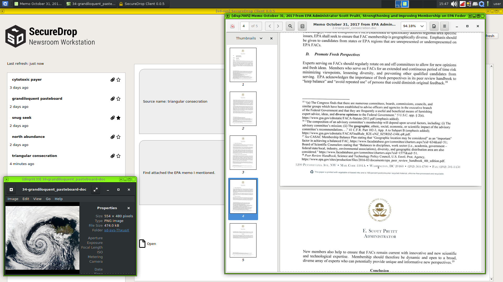
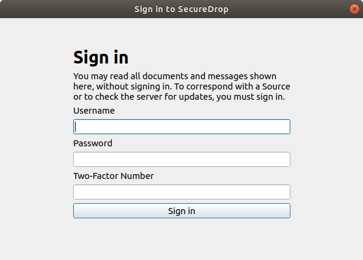
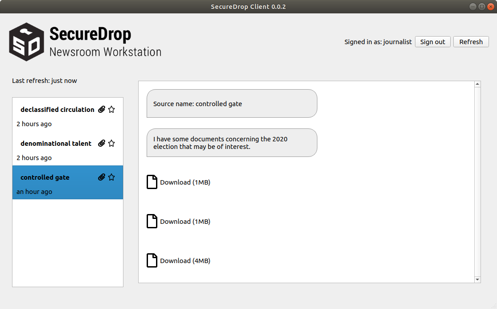

[](https://gitter.im/freedomofpress/securedrop?utm_source=badge&utm_medium=badge&utm_campaign=pr-badge)



## Bringing SecureDrop to Qubes

This project aims to make journalists' experience working with SecureDrop less onerous while retaining the current security and privacy features SecureDrop provides. We're doing that by moving the set of journalist-facing tools, which currently spans multiple Tails installations and requires physical USB drives to move data, to a single computer running multiple virtual machines, with data moved as automatically and transparently as possible between otherwise isolated VMs.

**IMPORTANT:** This project is in alpha, has known bugs and shortcomings, and should not be used in production environments. This README is geared towards interested technical users and developers. When reviewing the state of the project, please take into account [known bugs](https://github.com/search?utf8=%E2%9C%93&q=repo%3Afreedomofpress%2Fsecuredrop-workstation+repo%3Afreedomofpress%2Fsecuredrop-client+repo%3Afreedomofpress%2Fsecuredrop-proxy+repo%3Afreedomofpress%2Fsecuredrop-client+repo%3Afreedmofpress%2Fsecuredrop-sdk+repo%3Afreedomofpress%2Fqubes-template-securedrop-workstation+label%3Abug+state%3Aopen&type=Issues&ref=advsearch&l=&l=) and [security issues](https://github.com/search?utf8=%E2%9C%93&q=repo%3Afreedomofpress%2Fsecuredrop-workstation+repo%3Afreedomofpress%2Fsecuredrop-client+repo%3Afreedomofpress%2Fsecuredrop-proxy+repo%3Afreedomofpress%2Fsecuredrop-client+repo%3Afreedmofpress%2Fsecuredrop-sdk+repo%3Afreedomofpress%2Fqubes-template-securedrop-workstation+label%3Asecurity+state%3Aopen&type=Issues&ref=advsearch&l=&l=) that will be addressed in future releases.

### Detailed Rationale

SecureDrop's [architecture](https://docs.securedrop.org/en/latest/overview.html#infrastructure) and [threat model](https://docs.securedrop.org/en/stable/threat_model/threat_model.html) are proven, but the current approach also has major drawbacks:

- Journalists must access a separate, airgapped device to even validate that a submission is relevant. The airgapped workflow is complex and slow, and may reduce the reliance on SecureDrop overall.

- The complexity of the setup and the usage procedures create operational security risks. For example, journalists may accidentally boot up the wrong device using the _Secure Viewing Station_ (SVS) USB drive, breaking the airgap, or they may attempt "workarounds" to shortcut the laborious process of checking for submissions.

- Applying security updates to the SVS is difficult, which may cause administrators to wait a long time before doing so. While the SVS is airgapped, an insecure SVS still exposes additional vectors of attack, especially since the journalist is by design opening unknown files on the workstation.

- Once a document has been decrypted on the SVS, a journalist is more or less on their own right now. Work on the submission and the collaboration with other journalists are "not our department". Yet, security failures are likely during this stage. It's difficult to address this fundamental issue with the current workflow, since the SVS is essentially a dead end as far as SecureDrop is concerned.

The Qubes OS approach addresses this at multiple levels:

- By disabling Internet access and [mitigating against other exfiltration risks](https://en.wikipedia.org/wiki/Air_gap_malware) on a per-VM basis, we can combine multiple functions into a single device. Checking SecureDrop submissions is as simple as booting up your workstation, downloading recent submissions, and inspecting them. This has the potential to greatly reduce time and effort spent by SecureDrop journalists, administators and trainers, and to increase day-to-day SecureDrop use.

- Qubes OS' security model lets us add specific software features (such as redaction of documents) with careful consideration in each case what level of system or network access an application requires. This lets us gradually extend the functionality we can offer to journalists beyond the mere download of submissions.

- We can potentially add VMs that enable end-to-end encrypted communication with other SecureDrop journalists, intermediated by the SecureDrop server. This enables us to add software features that, for example, let journalists collaborate in categorizing submissions, assigning work, versioning changes to documents, and so on.

However, the Qubes OS approach is not without downsides. It stands and falls with the security of Qubes OS itself, which in turn may be impacted by Spectre/Meltdown type CPU level vulnerabilities, hypervisor vulnerabilities, and so on. These risks must be compared against the operational security risks of the current architecture, including the work that journalists do after downloading a submission. The Qubes OS website provides a useful [comparison of its security model with that of using a separate machine](https://www.qubes-os.org/intro/#how-does-qubes-os-compare-to-using-a-separate-physical-machine).

While we are strongly committed to piloting the use of Qubes OS for SecureDrop, no final decision has been made to move to this new architecture. This decision will require a full audit of this new approach, consideration of alternatives, and extensive validation with SecureDrop's current user community.

### Installation

Installing this project is involved. It requires an up-to-date Qubes 4.0 installation running on a machine with at least 12GB of RAM. You'll need access to a SecureDrop staging server as well.

#### Qubes 4.0

Before trying to use this project, install [Qubes 4.0](https://www.qubes-os.org/downloads/) on your development machine. Accept the default VM configuration during the install process.

After installing Qubes, you must update both dom0 and debian-9 template VM to include the latest version of the `qubes-kernel-vm-support` package.

##### `dom0`

Open a terminal in `dom0` by clicking on the Qubes menu top-right of the screen and left-clicking on Terminal Emulator and run:

```
sudo qubes-dom0-update
```

##### `debian-9`
Open a terminal in the `debian-9` TemplateVM and run:

```
sudo apt-get update
sudo apt-get upgrade
apt-cache policy qubes-kernel-vm-support
```

After verifying that the latest version of `qubes-kernel-vm-support` is installed, shut down the template VM:

```
sudo poweroff
```

#### Download, Configure, Copy to `dom0`

Decide on a VM to use for development. Clone this repo to your preferred location on that VM.

Next we need to do some SecureDrop-specific configuration:

- create a `config.json` based on `config.json.example` and include your values for the Journalist hidden service `.onion` hostname and PSK.
- create an `sd-journalist.sec` file in the root directory with the ASCII-armored GPG private key used to encrypt submissions in your test SecureDrop instance. The included key `sd-journalist.sec` is the one used by default in the SecureDrop staging instance.

Qubes provisioning is handled by Salt on `dom0`, so this project must be copied there from your development VM. That process is a little tricky, but here's one way to do it: assuming this code is checked out in your `work` VM at `/home/user/projects/securedrop-workstation`, run the following in `dom0`:

    qvm-run --pass-io work 'tar -c -C /home/user/projects securedrop-workstation' | tar xvf -

After that initial manual step, the code in your development VM may be copied into place on `dom0` by setting the `SECUREDROP_DEV_VM` and `SECUREDROP_DEV_DIR` environmental variables to reflect the VM and directory to which you've cloned this repo, and running `make clone` from the root of the project on `dom0`:

```
export SECUREDROP_DEV_VM=work    # set to your dev VM
export SECUREDROP_DEV_DIR=/home/user/projects/securedrop-workstation    # set to your working directory
make clone
```

#### Building

Once the configuration is done and this directory is copied to `dom0`, you must update existing Qubes templates and use `make` to handle all provisioning and configuration by your unprivileged user:

```
make all
```

The build process takes quite a while. You will be presented with a dialog asking how to connect to Tor: you should be able to select the default option and continue. You may wish to increase the scrollback in the dom0 terminal from 1000 (the default) to 100000, to ensure you can review any errors in the verbose output.

**NOTE:** Due to [issue #202](https://github.com/freedomofpress/securedrop-workstation/issues/202), the installation may fail with disk quota errors. If this happens, reboot the entire workstation and run `make all` again. The error will contain the following informating in your dom0 terminal:

```
qfile-agent : Fatal error: File copy: Disk quota exceeded; Last file: <...> (error type: Disk quota exceeded) '/usr/lib/qubes/qrexec-client-vm dom0 qubes.Receiveupdates /usr/lib/qubes/qfile-agent /var/lib/qubes/dom0-updates/packages/*.rpm' failed with exit code 1!
```

When the installation process completes, a number of new VMs will be available on your machine, all prefixed with `sd-`.

Proceed to the following steps to clean up templates on workstation, which are necessary due to the inclusion of end-of-life templates in Qubes 4.0.

##### Upgrading `sys-net`, `sys-usb` and `sys-firewall` to `fedora-28`

Qubes 4.0 ships with end-of-life `fedora-26` templates which are used by default for `sys-net`, `sys-firewall` and `sys-usb`. You need to manually upgrade `sys-net`, `sys-firewall` and `sys-usb` VMs to `fedora-28` by running the following commands in `dom0`:

```
qvm-kill sys-net
qvm-prefs sys-net template fedora-28
qvm-start sys-net

qvm-kill sys-firewall
qvm-prefs sys-firewall template fedora-28
qvm-start sys-firewall

qvm-kill sys-usb
qvm-prefs sys-usb template fedora-28
qvm-start sys-usb

```

Any other `fedora-26` VMs you may have created or that are installed by default (`work`, `personal`, `untrusted`, `vault`) should also be updated in the same manner.

You will also need to update the default disposable VM template to `fedora-28`:

```
qvm-create --template fedora-28 --label red fedora-28-dvm
qvm-prefs fedora-28-dvm template_for_dispvms True
qubes-prefs default_dispvm fedora-28-dvm
```

You can then delete the end-of-life `fedora-26` template in `dom0` by running:

```
sudo dnf remove qubes-template-fedora-26
```

If this command produces an error, open the Qube Manager and ensure that there are no remaining VMs using the `fedora-26` template.

#### Upgrading `sys-whonix` and `whonix-ws` AppVMs to Whonix 14

Qubes 4.0 also ships with end-of-life Whonix templates (`whonix-gw` and `whonix-ws`).`sys-whonix` is used by `sd-whonix` to fetch updates, and should be upgraded. You should destroy `whonix-gw` from the Qube Manager and re-provision a new `sys-whonix` AppVM based on `whonix-gw-14` with the option **provides network**. You will need to delete the `whonix-ws-dvm` and `anon-whonix` VMs. You can then remove the end-of-life templates by running the following commands in `dom0`:

```
sudo dnf remove qubes-template-whonix-gw
sudo dnf remove qubes-template-whonix-ws
```

Upon release, Qubes 4.0.1 will no longer ship `fedora-26` or older Whonix templates, and the above steps will no longer be necessary.

Finally, update all the templates and reboot the machine. Your workstation will then be ready for use. In `dom0`, run:

```
sudo securedrop-update
```

#### Using the *SecureDrop Client*


Once your workstation environment is set up, you will be able to manage messages and submissions through a graphical user interface.

First, power on the workstation. When prompted, enter the *Disk Password* and press Enter to unlock the workstation. Then, when the login dialog box appears, enter the *Login Password* and click **Log in**.

To launch the *SecureDrop Client*, temporarily until [this issue](https://github.com/freedomofpress/securedrop-workstation/issues/198) is resolved, you should from a `dom0` terminal `qvm-run sd-svs securedrop-client`. This will start the *SecureDrop Client* in the `sd-svs` AppVM.

##### Signing in

You should see a login prompt similar to the following:



In the background, you will see any previously downloaded messages. This is intended behavior: You do not have to sign into the server to browse the messages and files you have downloaded using the client. To work offline, press Esc to close the sign-in dialog.

If the sign-in fails, make sure to wait for another Two-Factor Code before trying again. To troubleshoot, verify that you can successfully sign in by visiting the .onion address of your *Journalist Interface* in the Tor browser in the `sd-proxy` AppVM.

##### Viewing messages and documents

After the sign-in or the next time you attempt to view encrypted content, you will be prompted by a dialog asking “Do you allow VM ‘sd-svs’ to access your GPG keys (now and for the following 28800 seconds)?”. Click **Yes**.

Once you are successfully signed in, you should see a screen similar to the following:



On the left-hand side, you will see a list of sources who have submitted messages or documents to your SecureDrop instance. Each source is represented by a two word designation like “controlled gate”. You can display the messages and documents associated with a source by clicking its entry in the list.

On the right-hand side, you will see the messages and documents associated with the currently selected source, in chronological order (newest at the bottom).

Replies, if any, from onboarded journalists to SecureDrop will appear in the conversation flow.

When the client starts, it will begin downloading messages and replies, and immediately decrypt them such that it can show the decrypted content in the conversation view. This will produce a request to access your GPG keys as described above, and is part of normal behavior.

Because of their potential size, documents are not downloaded immediately to the workstation. To download a document from the server, click its entry, which should say something like “Download (10MB)” for a 10MB file.

To open a downloaded file, click the “Open” icon. Note that we do not currently display the filenames of files that have been downloaded and decrypted, but this will be [done in a future release](https://github.com/freedomofpress/securedrop-client/issues/163).

Opening a file in this manner will launch a non-networked [disposable Virtual Machine](https://www.qubes-os.org/doc/dispvm/) with the Debian GNU/Linux operating system. This process takes several seconds. You will see a Qubes OS notification telling you that the DispVM is starting. After a few seconds, another notification will be displayed telling you that the DispVM has started.

Do not repeatedly click the “Open” icon; instead, wait for the process to complete. Your workstation memory limits the number of disposable VMs you can launch; we recommend closing previously opened documents before opening new ones.

Files are opened in disposable VMs to ensure that any malware contained within files cannot access any other part of the workstation. The disposable VMs do not have Internet access, to prevent exfiltration of data through embedded resources or scripts.  Changes you make within the disposable VM will be lost after you close the associated window(s).

**Note:** If an appropriate application is not available in the disposable VM, you will be alerted with the following dialog: “Unable to handle mimetype of the requested file (exit status: 768)!”. Click **OK**. The DispVM will shut down and be deleted. Please don't hesitate to [file an issue](https://github.com/freedomofpress/securedrop-workstation/issues/new) for formats that you believe should be supported. For now, we recommend testing with TXT, PDF or MP4 files. Common word processor formats will be supported soon, once we have sufficiently hardened the installation of LibreOffice ([issue 205](https://github.com/freedomofpress/securedrop-workstation/issues/205)).

While you are logged in, the workstation will check for new messages and documents every 5 minutes. You can also force a check by clicking the “Refresh” button.

Closing the client application will sign you out of the server. If you manually sign out using the “Sign out” button, you can browse previously downloaded messages and documents without Internet connectivity.

After you have completed your session, we strongly recommend shutting down the workstation (as opposed to sleeping the system) and storing it in a secure location.

Replies and Source Deletion will be added in the next major release of the *SecureDrop Workstation*.


##### Exporting documents

**WARNING:** Opening files from an unknown origin presents certain risks (malware, fingerprinting). While the workstation helps reduce these risks by offering VM-level isolation, transferring documents to another host without the same level of isolation may expose you to these risks. Using tools to sanitize submitted documents, such as right-clicking a .pdf and selecting "Convert to trusted PDF" in Qubes OS, may help mitigate some of these risks. Further mitigating these risks will be a focus of future development.

Exporting documents directly from within the *SecureDrop Client* is not currently supported, but you can export documents manually via USB by following these steps:

1. Create an export VM based on `sd-workstation-template`.
   1. Click the Qubes menu in the upper left of the screen.
   2. Click **Create Qubes VM**
   3. Name the VM `sd-export`
   4. Set the template as `sd-workstation-template`
   5. Set networking to (none).
   6. Click **OK** to create the VM.
2. Start the VM. Again from the Qubes menu:
   1. Select "Domain: sd-export"
   2. Click "export: Files". This will launch the file manager in the export VM.
   3. Insert your USB drive into the workstation. A notification will pop up indicating the name of your USB device, e.g. "Innostor_PenDrive".
   4. In the upper right hand side of your screen, there is a small icon in the system tray with a USB drive. Click that icon.
   5. Select the name of your USB drive.
   6. Click the **+** icon next to the `sd-export` VM.
3. You can use the command line in `sd-svs` to manually move selected files:

```
qvm-copy-to-vm sd-export ~/.securedrop_client/data/name-of-file
```

4. You may now use the File manager that you opened in `sd-export` to move files from `~/QubesIncoming/sd-svs` to the USB drive. Delete the original file from `~/QubesIncoming/sd-svs` once it has been moved. Note that the drive and files are not encrypted, so ensure that the key is properly erased and/or destroyed after use.

The development plan is to provide functionality in the *SecureDrop Client* that automates step 3, and assists the user in taking these steps via GUI prompts. Eventually we plan to provide other methods for export, such as [OnionShare](https://onionshare.org/) (this will require the attachment of a NetVM), using a dedicated export VM template with tools such as OnionShare and Veracrypt. The next section includes instructions to approximate the OnionShare sharing flow.

##### Transferring files via OnionShare
1. Create an `sd-onionshare-template` VM based on `fedora-28`:
   1. Click on the Qubes menu in the upper left, select "Template: Fedora 28", click on "fedora-28: Qube Settings", and click on **Clone Qube**
   2. Name the cloned qube `sd-onionshare-template`
   3. In the Qubes menu on the top-left, select "Template: sd-onionshare-template" and click on "sd-onionshare-template: Terminal"
   4. Install OnionShare: `sudo dnf install onionshare`
   5. Shut down the template: `sudo poweroff`
2. Create a new AppVM based on `sd-onionshare-template`
   1. Click on the Qubes menu in the upper left of the screen.
   2. Click **Create Qubes VM**
   3. Name the VM `sd-onionshare`
   4. Set the template as `sd-onionshare-template`
   5. Set networking to `sys-firewall`.
   6. Check the box "launch settings after creation"
   7. Click **OK** to create the VM.
   8. In the settings, under "Applications", add OnionShare from the "Available" to the "Selected" list.
   9. Click **OK**.
3. Start the `sd-onionshare` VM and open OnionShare
   1. In the Qubes menu on the top-left, select "Domain: sd-onionshare" and click on "OnionShare"
   2. Click the settings gear on the bottom right of the OnionShare window and de-select "Stop sharing after first download" (this due to a [known bug in OnionShare](https://github.com/micahflee/onionshare/issues/812))
4. You can use the command line in `sd-svs` to manually move selected files (this part will be replaced by functionality in the `sd-svs` client):

```
qvm-copy-to-vm sd-onionshare ~/.securedrop_client/data/name-of-file
```

5. You may now return to the OnionShare window, click on add and select the file you transferred from `sd-svs` by browsing to `~/QubesIncoming/sd-svs`.
6. On the target machine, navigate to the Tor onion service URL provided by OnionShare using the Tor Browser to retrieve the file.
7. Close OnionShare and delete the decrypted submission on `sd-onionshare` from `~/QubesIncoming/sd-svs`

##### Printing

Printing directly from the `sd-svs` AppVM or the disposable VMs will not be supported. The development plan is to instruct admins to install printer drivers in a template associated with a new printing VM. This template will not be shared with any other VMs.

#### Automatic updates

The `securedrop-update` script will automatically update packages in all TemplateVMs, as well as `dom0`, as part of a daily cron job. This script will also run the salt provisioning logic to ensure the state is consistent. Because AppVMs must be rebooted after a TemplateVM upgrade, a message will inform users to reboot their workstations to apply changes.

To update workstation provisioning logic, one must use the `work` AppVM that was created during the install. From your checkout directory, run the following commands (replace `<tag>` with the tag of the release you are working with):

```
git fetch --tags
git tag -v <tag>
git checkout <tag>
```

In `dom0`:

```
make clone
make all
```

In the future, we plan on shipping a *SecureDrop Workstation* installer package as an RPM package in `dom0` to automatically update the salt provisioning logic.

### Architecture

The current architecture replaces the *Journalist Workstation* and *Secure Viewing Station* Tails installations with specially-configured Qubes VMs; these are the VMs the user will primarily interact with. There are a number of other configured VMs which provide ancillary services.


Currently, the following VMs are provisioned:

- `sd-proxy` is where the SecureDrop proxy resides, which allows the non-networked `sd-svs` vm to communicate with the *Journalist Interface* over Tor.
- `sd-svs` is a non-networked VM in which the *SecureDrop Client* runs used to store and explore submissions after they're unarchived and decrypted. Any files opened in this VM are opened in a disposable VM.
- `sd-whonix` is the Tor gateway used to contact the journalist Tor hidden service. It's configured with the auth key for the hidden service. The default Qubes Whonix workstation uses the non-SecureDrop Whonix gateway, and thus won't be able to access the *Journalist Interface*.
- `sd-gpg` is a Qubes split-gpg AppVM, used to hold submission decryption keys and do the actual submission crypto.
- `sd-dispvm` is an AppVM used as the template for the disposable VMs used for processing and opening files.

Submissions are processed in the following steps:

1. Journalist uses the *SecureDrop Client* to access the *Journalist Interface* via the Journalist API. After logging in, the journalist clicks
on any submission of interest.
2. The *SecureDrop Client* will use `sd-gpg` to decrypt the submission using Qubes' split-GPG functionality (decryption is done in a trusted, isolated VM, keeping GPG keys off of the system-wide DispVM).
5. The decrypted submission is stored on the `sd-svs` *Secure Viewing Station VM*, where it's placed in a local database.
6. Any file opened by the *SecureDrop Client* in the *Secure Viewing Station VM* is opened in a Disposable VM, largely mitigating attacks from malicious content.

See below for a closer examination of this process, and see `docs/images` for screenshots related to the steps above.

### What's In This Repo?

This project can be broken neatly into two parts: 1) a set of salt states and `top` files which configure the various VMs, and 2) scripts and system configuration files which set up the document handling process.

Qubes uses SaltStack internally for VM provisionining and configuration management (see https://www.qubes-os.org/doc/salt/), so it's natural for us to use it as well. The `dom0` directory contains salt `.top` and `.sls` files used to provision the VMs noted above.
- `Makefile` is used with the `make` command on `dom0` to build the Qubes/SecureDrop installation, and also contains some development and testing features.
- The [SecureDrop Client](https://github.com/freedomofpress/securedrop-client) is installed in `sd-svs` and will be used to access the SecureDrop server *Journalist Interface* via the SecureDrop proxy.
- The [SecureDrop Proxy](https://github.com/freedomofpress/securedrop-proxy) is installed in `sd-proxy` to communicate to the SecureDrop server *Journalist Interface* via `sd-whonix`.
- Within `sd-svs`, the *SecureDrop Client* will open all submissions in the `sd-svs-disp` disposable VM.
- `config.json.example` is an example config file for the provisioning process. Before use, you should copy it to `config.json`, and adjust to reflect your environment.
- `sd-journalist.sec.example` is an example GPG private key for use in decrypting submissions. It must match the public key set on a SecureDrop server used for testing. Before use, you should copy it to `sd-journalist.sec`, or store the submission key used with your SecureDrop server as `sd-journalist.sec`.

### Development

This project's development requires different workflows for working on provisioning components and working on submission-handling scripts.

For developing salt states and other provisioning components, work is done in a development VM and changes are made to individual state and top files there. In the `dom0` copy of this project, `make clone` is used to copy over the updated files; `make <vm-name>` to rebuild an individual VM; and `make all` to rebuild the full installation. Current valid target VM names are `sd-proxy`, `sd-gpg`, `sd-whonix`, and `disp-vm`. Note that `make clone` requires two environment variables to be set: `SECUREDROP_DEV_VM` must be set to the name of the VM where you've been working on the code, the `SECUREDROP_DEV_DIR` should be set to the directory where the code is checked out on your development VM.

For developing submission processing scripts, work is done directly in the virtual machine running the component. To commit, copy the updated files to a development VM with `qvm-copy-to-vm`and move the copied files into place in the repo. (This process is a little awkward, and it would be nice to make it better.)

### Testing

Tests should cover two broad domains. First, we should assert that all the expected VMs exist and are configured as we expect (with the correct NetVM, with the expected files in the correct place). Second, we should end-to-end test the document handling scripts, asserting that files present in the `sd-proxy` VM correctly make their way to the `sd-svs` AppVM, and are opened correctly in disposable VMs.

#### Configuration Tests

These tests assert that expected scripts and configuration files are in the correct places across the VMs. These tests can be found in the `tests/` directory. They can be run from the project's root directory on `dom0` with:

    make test

Note that since tests confirm the states of provisioned VMs, they should be run _after_ all the VMs have been built with `make all`.

Individual tests can be run with `make <test-name>`, where `test-name` is one of `test-svs`, `test-journalist`, `test-whonix`, or `test-disp`.

Be aware that running tests *will* power down running SecureDrop VMs, and may result in *data loss*. Only run tests in a development / testing environment.

## Building the Templates

1. Create a `fedora-28` AppVM for building
2. Increase the disk size to at least 15GB (as the build uses over 10GB)
3. Import the QubesOS master key and the GPG key used to sign tags (see https://www.qubes-os.org/security/verifying-signatures/)
4. Run `make template` in the top-level of this repository.
5. Copy the rpm generated in `/home/user/src/securedrop-workstation/builder/qubes-builder/qubes-src/linux-template-builder/rpm/` to `dom0`
6. Install the template in `dom0` : `sudo rpm -i <file>.rpm` (this takes a few minutes)
7. Create a new VM based on this template:
```
qvm-create --template grsec-workstation test-grsec-kernels --class AppVM --property virt_mode=hvm --property kernel='' --label green
```

## Building workstation deb packages

```
# go to the builder/ directory:
cd builder/packages
# build a specific package (e.g, grsecurity metapackage)
make securedrop-workstation-grsec
# OR build all the packages
make all
# run the tests
pipenv install -d
pipenv shell
# install test requirements and run the test
apt install lintian
make test
```

## Threat model

This section outlines the threat model for the *SecureDrop Workstation*, and should complement [SecureDrop's threat model](https://docs.securedrop.org/en/stable/threat_model/threat_model.html). This document is always a work in progress, if you have any questions or comments, please open an issue on [GitHub](https://github.com/freedomofpress/securedrop-workstation) or send an email to [securedrop@freedom.press](mailto:securedrop@freedom.press).

### Assumptions

#### Assumptions About the SecureDrop Servers

* The SecureDrop *Application* and *Monitor* servers are properly installed and configured.
* Operational security, administration and usage of the SecureDrop instance follows the guidance provided by the SecureDrop documentation.

#### Assumptions About the *Securedrop Workstation* Install

* *SecureDrop Workstation* was installed correctly
* Updates are applied to *SecureDrop Workstation* provisioning code, VM templates and `dom0` as they are available.

#### Assumptions About the World

* The security assumptions of dm-crypt and LUKS are valid.
* The security assumptions of Tor, the Hidden Service protocol and Hidden Service authentication are valid.
* The security assumptions of RSA are valid.
* The security assumptions of the Qubes operating system are valid.
* The security assumptions of the Xen hypervisor are valid.

### Attack Scenarios

As the *SecureDrop Workstation* is not Internet-reachable, an attacker must first obtain code execution on a virtual machine. This can be achieved through a malicious SecureDrop submission, websites visited by a journalist or a vulnerability in the provisioning code and its dependencies. The Virtual Machine in which the adversary obtains code execution will dictate what information is potentially compromised, as well as the attack surface exposed for lateral movement or escalation of privilege.

#### What Compromise of the *Display VM* (`sd-svs-disp`) Can Achieve

The *Display VM* (sd-svs-disp) is disposable, does not have network access, and is used to display only one submission before being destroyed.

* An adversary can read the decrypted submission.
* An adversary can attempt to elevate their privileges and escape the VM.
* An adversary can attempt to communicate through a side channel to another VM or device in the *SecureDrop Workstation's* environment.

#### What Compromise of the *Proxy VM* (`sd-proxy`) Can Achieve

* An adversary can intercept and modify any and all communication between the Tor Browser and the SecureDrop *Journalist Interface*, including but not limited to:
  * Send messages to (but not view messages from) sources.
  * Delete messages and submissions.
  * Access encrypted messages and submissions.
  * Access plaintext journalist passwords to the *Journalist Interface*.
* An adversary can attempt to elevate their privileges and escape the VM.

#### What Compromise of the *Whonix Gateway VM* (`sd-whonix`) Can Achieve

* An adversary can obtain the *Journalist Interface's* ATHS cookie.
* An adversary can intercept and modify any and all communication between the Proxy VM and the SecureDrop *Journalist Interface*, including but not limited to:
  * Send messages to sources (but not view messages from a source).
  * Delete messages and submissions.
  * Access encrypted messages and submissions.
  * Access plaintext journalist passwords to the *Journalist Interface*.
* An adversary can attempt to elevate their privileges and escape the VM.

#### What compromise of the *SVS VM* (`sd-svs`) can achieve
The *SVS VM* is where securedrop-client resides. It does not have network access, and the Qubes split-gpg mechanism permits access to GPG keys from this VM.
* An adversary can view all decrypted submissions.
* An adversary can decrypt arbitrary encrypted submissions.
* An adversary can interact with the SecureDrop *Journalist Interface* or modify SecureDrop client code.
* An adversary can attempt to elevate their privileges and escape the VM.

#### What Compromise of the *GPG VM* (`sd-gpg`) Can Achieve

The *GPG VM* does not have network access, and the Qubes split-gpg mechanism restricts access to this VM per the Qubes GPG RPC policy.

* An adversary can decrypt and encrypted message or submission.
* An adversary can store and view any message that is being decrypted by the *SecureDrop Workstation*.
* An adversary can attempt to elevate their privileges and escape the VM.

#### What Compromise of `dom0` Can Achieve

`dom0` can do all of the above: spawn arbitrary virtual machines, access all data, modify all *SecureDrop Workstation* provisioning code, as well as introduce mechanisms to establish persistence and exfiltrate data. By design, Qubes' `dom0` does not have network access, files cannot be copied to `dom0`, and clipboard sharing is disabled.
