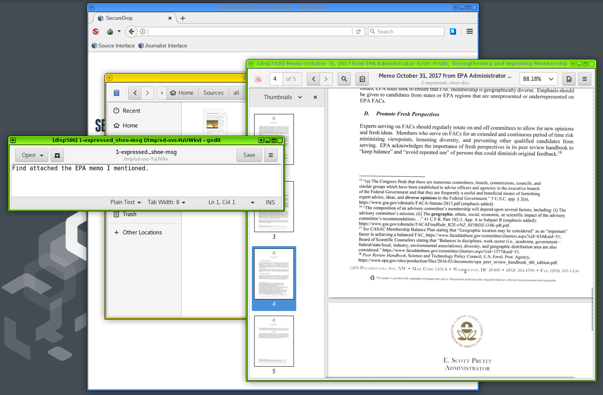

[](https://gitter.im/freedomofpress/securedrop?utm_source=badge&utm_medium=badge&utm_campaign=pr-badge)



## Bringing SecureDrop to Qubes

This project aims to make journalists' experience working with SecureDrop less onerous while retaining the current security and privacy features SecureDrop provides. We're doing that by moving the set of journalist-facing tools, which currently spans multiple Tails installations and requires physical USB drives to move data, to a single computer running multiple virtual machines, with data moved as automatically and transparently as possible between otherwise isolated VMs.

This project is under active development, has known bugs and shortcomings, and is not ready for end users. This README is geared towards interested technical users and developers.

### Detailed Rationale

SecureDrop's [architecture](https://docs.securedrop.org/en/latest/overview.html#infrastructure) and [threat model](https://docs.securedrop.org/en/stable/threat_model/threat_model.html) are proven, but the current approach also has major drawbacks:

- Journalists must access a separate, airgapped device to even validate that a submission is relevant. This is very onerous, and may reduce the reliance on SecureDrop overall.

- The complexity of the setup and the usage procedures create operational security risks. For example, journalists may accidentally boot up the wrong device using the _Secure Viewing Station_ (SVS) USB drive, breaking the airgap, or they may attempt "workarounds" to shortcut the onerous process of checking for submissions.

- Applying security updates to the SVS is difficult, which may cause administrators to wait a long time before doing so. While the SVS is airgapped, an insecure SVS still exposes additional vectors of attack, especially since the journalist is by design opening unknown files on the workstation.

- Once a document has been decrypted on the SVS, a journalist is more or less on their own right now. Work on the submission and the collaboration with other journalists are "not our department". Yet, security failures are likely during this stage. It's difficult to address this fundamental issue with the current workflow, since the SVS is essentially a dead end as far as SecureDrop is concerned.

The Qubes OS approach addresses this at multiple levels:

- By disabling Internet access and [mitigating against other exfiltration risks](https://en.wikipedia.org/wiki/Air_gap_malware) on a per-VM basis, we can combine multiple functions into a single device. Checking SecureDrop submissions is as simple as booting up your workstation, downloading recent submissions, and inspecting them. This has the potential to greatly reduce time and effort spent by SecureDrop journalists, administators and trainers, and to increase day-to-day SecureDrop use.

- Qubes OS' security model lets us add specific software features (such as redaction of documents) with careful consideration in each case what level of system or network access an application requires. This lets us gradually extend the functionality we can offer to journalists beyond the mere download of submissions.

- We can potentially add VMs that enable end-to-end encrypted communication with other SecureDrop journalists, intermediated by the SecureDrop server. This enables us to add software features that, for example, let journalists collaborate in categorizing submissions, assigning work, versioning changes to documents, and so on.

However, the Qubes OS approach is not without downsides. It stands and falls with the security of Qubes OS itself, which in turn may be impacted by Spectre/Meltdown type CPU level vulnerabilities, hypervisor vulnerabilities, and so on. These risks must be compared against the operational security risks of the current architecture, including the work that journalists do after downloading a submission. The Qubes OS website provides a useful [comparison of its security model with that of using a separate machine](https://www.qubes-os.org/intro/#how-does-qubes-os-compare-to-using-a-separate-physical-machine).

While we are strongly committed to piloting the use of Qubes OS for SecureDrop, no final decision has been made to move to this new architecture. This decision will require a full audit of this new approach, consideration of alternatives, and extensive validation with SecureDrop's current user community.

### Using This Repo

Installing this project is involved. It requires an up-to-date Qubes 4.0 installation running on a machine with at least 12GB of RAM. You'll need access to a SecureDrop staging server as well.

#### Qubes 4.0

Before trying to use this project, install [Qubes 4.0](https://www.qubes-os.org/downloads/) on your development machine. Accept the default VM configuration during the install process.

After installing Qubes, update your debian-9 template VM to include the latest version of the `qubes-kernel-vm-support` package. Open a terminal in the debian-9 VM and run:

```
sudo apt-get update
sudo apt-get upgrade
apt-cache policy qubes-kernel-vm-support
```

After verifying that the latest version of `qubes-kernel-vm-support` is installed, shut down the template VM:

```
sudo poweroff
```

#### Download, Configure, Copy to dom0

Decide on a VM to use for development. Clone this repo to your preferred location on that VM.

Next we need to do some SecureDrop-specific configuration:

- edit `config.json` to include your values for the Journalist hidden service `.onion` hostname and PSK.
- Replace the `sd-journalist.sec` file in the root directory with the GPG private key used to encrypt submissions in your test SecureDrop instance. The included key is the one used by default in the SecureDrop staging instance.

Qubes provisioning is handled by Salt on `dom0`, so this project must be copied there from your development VM. That process is a little tricky, but here's one way to do it: assuming this code is checked out in your `work` VM at `/home/user/projects/securedrop-workstation`, run the following in `dom0`:

    qvm-run --pass-io work 'tar -c -C /home/user/projects securedrop-workstation' | tar xvf -

After that initial manual step, the code in your development VM may be copied into place on `dom0` by setting the `SECUREDROP_DEV_VM` and `SECUREDROP_DEV_DIR` environmental variables to reflect the VM and directory to which you've cloned this repo, and running `make clone` from the root of the project on `dom0`:

```
export SECUREDROP_DEV_DIR=sd-dev    # set to your dev VM
export SECUREDROP_DEV_DIR=/home/user/projects/securedrop-workstation    # set to your working directory
make clone
```

#### Building

Once the configuration is done and this directory is copied to `dom0`, you must update existing Qubes templates and use `make` to handle all provisioning and configuration by your unprivileged user:

```
make all
```

The build process takes quite a while. You will be presented with a dialogue asking how to connect to Tor: you should be able to select the default option and continue. You may wish to increase the scrollback in the dom0 terminal from 1000 (the default) to 100000, to ensure you can review any errors in the verbose output.

When the installation process completes, a number of new VMs will be available on your machine, all prefixed with `sd-`.

*note* If you've previously installed sd-workstation before January 2018, you may need to run this in dom0 once, by hand, in order to install cleanly:

    sudo qubesctl top.disable sd-dispvm

#### Initial Use

From the "Q" menu, open SecureDrop Client in the `sd-svs` machine.

Once you've logged in, select submissions to download.
That download kicks off a series of steps (described below) which will eventually leave decrypted messages in the SecureDrop Client interface, and files that are clicked will be opened in a disposable VM.

### Architecture

The current architecture replaces the `Journalist Workstation` and `Secure Viewing Station` Tails installations with specially-configured Qubes VMs; these are the VMs the user will primarily interact with. There are a number of other configured VMs which provide ancillary services.


Currently, the following VMs are provisioned:

- `sd-proxy` is where the SecureDrop proxy resides, which allows the non-networked `sd-svs` vm to communicate with the Journalist Interface over Tor..
- `sd-svs` is a non-networked VM in which the SecureDrop Client runs used to store and explore submissions after they're unarchived and decrypted. Any files opened in this VM are opened in a disposable VM.
- `sd-whonix` is the Tor gateway used to contact the journalist Tor hidden service. It's configured with the auth key for the hidden service. The default Qubes Whonix workstation uses the non-SecureDrop Whonix gateway, and thus won't be able to access the `Journalist Interface`.
- `sd-gpg` is a Qubes split-gpg AppVM, used to hold submission decryption keys and do the actual submission crypto.
- `sd-dispvm` is an AppVM used as the template for the disposable VMs used for processing and opening files.

Submissions are processed in the following steps:

1. Journalist uses the SecureDrop Client to access the Journalist Interface via the Journalist API. After logging in, the journalist clicks
on any submission of interest.
2. The SecureDrop client will use `sd-gpg` to decrypt the submission using Qubes' split-GPG functionality (decryption is done in a trusted, isolated VM, keeping GPG keys off of the system-wide DispVM).
5. The decrypted submission is stored on the `sd-svs` Secure Viewing Station VM, where it's placed in a local database.
6. Any file opened by the SecureDrop Client in the Secure Viewing Station is opened in a Disposable VM, largely mitigating attacks from malicious content.

See below for a closer examination of this process, and see `docs/images` for screenshots related to the steps above.

### What's In This Repo?

This project can be broken neatly into two parts: 1) a set of salt states and `top` files which configure the various VMs, and 2) scripts and system configuration files which set up the document handling process.

Qubes uses SaltStack internally for VM provisionining and configuration management (see https://www.qubes-os.org/doc/salt/), so it's natural for us to use it as well. The `dom0` directory contains salt `.top` and `.sls` files used to provision the VMs noted above.
- `Makefile` is used with the `make` command on dom0 to build the Qubes/SecureDrop installation, and also contains some development and testing features.
- The [SecureDrop Client](https://github.com/freedomofpress/securedrop-client) is installed in `sd-svs` and will be used to access the SecureDrop server Journalist Interface via the SecureDrop proxy.
- The [SecureDrop Proxy](https://github.com/freedomofpress/securedrop-proxy) is installed in `sd-proxy` to communicate to the SecureDrop server Journalist Interface via `sd-whonix`.
- Within `sd-svs`, the SecureDrop client will open all submissions in the `sd-svs-disp` disposable VM.
- `config.json.example` is an example config file for the provisioning process. Before use, you should copy it to `config.json`, and adjust to reflect your environment.
- `sd-journalist.sec.example` is an example GPG private key for use in decrypting submissions. It must match the public key set on a SecureDrop server used for testing. Before use, you should copy it to `sd-journalist.sec`, or store the submission key used with your SecureDrop server as `sd-journalist.sec`.

### Development

This project's development requires different workflows for working on provisioning components and working on submission-handling scripts.

For developing salt states and other provisioning components, work is done in a development VM and changes are made to individual state and top files there. In the `dom0` copy of this project, `make clone` is used to copy over the updated files; `make <vm-name>` to rebuild an individual VM; and `make all` to rebuild the full installation. Current valid target VM names are `sd-proxy`, `sd-gpg`, `sd-whonix`, and `disp-vm`. Note that `make clone` requires two environment variables to be set: `SECUREDROP_DEV_VM` must be set to the name of the VM where you've been working on the code, the `SECUREDROP_DEV_DIR` should be set to the directory where the code is checked out on your development VM.

For developing submission processing scripts, work is done directly in the virtual machine running the component. To commit, copy the updated files to a development VM with `qvm-copy-to-vm`and move the copied files into place in the repo. (This process is a little awkward, and it would be nice to make it better.)

### Testing

Tests should cover two broad domains. First, we should assert that all the expected VMs exist and are configured as we expect (with the correct NetVM, with the expected files in the correct place). Second, we should end-to-end test the document handling scripts, asserting that files present in the `sd-proxy` VM correctly make their way to the `sd-svs` AppVM, and are opened correctly in disposable VMs.

#### Configuration Tests

These tests assert that expected scripts and configuration files are in the correct places across the VMs. These tests can be found in the `tests/` directory. They can be run from the project's root directory on `dom0` with:

    make test

Note that since tests confirm the states of provisioned VMs, they should be run _after_ all the VMs have been built with `make all`.

Individual tests can be run with `make <test-name>`, where `test-name` is one of `test-svs`, `test-journalist`, `test-whonix`, or `test-disp`.

Be aware that running tests *will* power down running SecureDrop VMs, and may result in *data loss*. Only run tests in a development / testing environment.

## Building the Templates

1. Create a fedora-28 AppVM for building
2. Increase the disk size to at least 15GB (as the build uses over 10GB)
3. Import the QubesOS master key and the GPG key used to sign tags (see https://www.qubes-os.org/security/verifying-signatures/)
4. Run `make template` in the top-level of this repository.
5. Copy the rpm generated in `/home/user/src/securedrop-workstation/builder/qubes-builder/qubes-src/linux-template-builder/rpm/` to `dom0`
6. Install the template in `dom0` : `sudo rpm -i <file>.rpm` (this takes a few minutes)
7. Create a new VM based on this template:
```
qvm-create --template grsec-workstation test-grsec-kernels --class AppVM --property virt_mode=hvm --property kernel='' --label green
```

## Building workstation deb packages

```
# go to the builder/ directory:
cd builder/packages
# build a specific package (e.g, grsecurity metapackage)
make securedrop-workstation-grsec
# OR build all the packages
make all
# run the tests
pipenv install -d
pipenv shell
# install test requirements and run the test
apt install lintian
make test
```

## Threat model

This section outlines the threat model for the SecureDrop workstation, and should complement [SecureDrop's threat model](https://docs.securedrop.org/en/stable/threat_model/threat_model.html). This document is always a work in progress, if you have any questions or comments, please open an issue on [GitHub](https://github.com/freedomofpress/securedrop-workstation) or send an email to [securedrop@freedom.press](mailto:securedrop@freedom.press).

### Assumptions

#### Assumptions About the SecureDrop Servers

* The SecureDrop *Application* and *Monitor* servers are properly installed and configured.
* Operational security, administration and usage of the SecureDrop instance follows the guidance provided by the SecureDrop documentation.

#### Assumptions About the Securedrop Workstation Install

* SecureDrop workstation was installed correctly
* Updates are applied to SecureDrop Workstation provisioning code, VM templates and dom0 as they are available.

#### Assumptions About the World

* The security assumptions of dm-crypt and LUKS are valid.
* The security assumptions of Tor, the Hidden Service protocol and Hidden Service authentication are valid.
* The security assumptions of RSA are valid.
* The security assumptions of the Qubes operating system are valid.
* The security assumptions of the Xen hypervisor are valid.

### Attack Scenarios

As the SecureDrop workstation is not Internet-reachable, an attacker must first obtain code execution on a virtual machine. This can be achieved through a malicious SecureDrop submission, websites visited by a journalist or a vulnerability in the provisioning code and its dependencies. The Virtual Machine in which the adversary obtains code execution will dictate what information is potentially compromised, as well as the attack surface exposed for lateral movement or escalation of privilege.

#### What Compromise of the *Display VM* Can Achieve

The *Display VM* is disposable, does not have network access, and is used to display only one submission before being destroyed.

* An adversary can read the decrypted submission.
* An adversary can attempt to elevate their privileges and escape the VM.
* An adversary can attempt to communicate through a side channel to another VM or device in the SecureDrop Workstation's environment.

#### What Compromise of the *Journalist VM* Can Achieve

* An adversary can intercept and modify any and all communication between the Tor Browser and the SecureDrop Journalist interface, including but not limited to:
  * Send messages to (but not view messages from) sources.
  * Delete messages and submissions.
  * Access encrypted messages and submissions.
  * Access plaintext passwords to the Journalist interface.
* An adversary can attempt to elevate their privileges and escape the VM.

#### What Compromise of the *Whonix Gateway VM* Can Achieve

* An adversary can obtain the Journalist Interface's ATHS cookie.
* An adversary can intercept and modify any and all communication between the Journalist VM and the SecureDrop Journalist interface, including but not limited to:
  * Send messages to sources (but not view messages from a source).
  * Delete messages and submissions.
  * Access encrypted messages and submissions.
  * Access plaintext passwords to the Journalist interface.
* An adversary can attempt to elevate their privileges and escape the VM.

#### What compromise of the *SVS VM* can achieve
The *SVS VM* does not have network access, and the Qubes split-gpg mechanism permits access to GPG keys from this VM.
* An adversary can view all decrypted submissions.
* An adversary can decrypt arbitrary submission.
* An adversary can attempt to elevate their privileges and escape the VM.

#### What Compromise of the *GPG VM* Can Achieve

The *GPG VM* does not have network access, and the Qubes split-gpg mechanism restricts access to this VM per the Qubes GPG RPC policy.

* An adversary can decrypt and encrypted message or submission.
* An adversary can store and view any message that is being decrypted by the SecureDrop Workstation.
* An adversary can attempt to elevate their privileges and escape the VM.

#### What Compromise of *dom0* Can Achieve

*Dom0* can do all of the above: spawn arbitrary virtual machines, access all data, modify all SecureDrop Workstation provisioning code, as well as introduce mechanisms to establish persistence and exfiltrate data.
