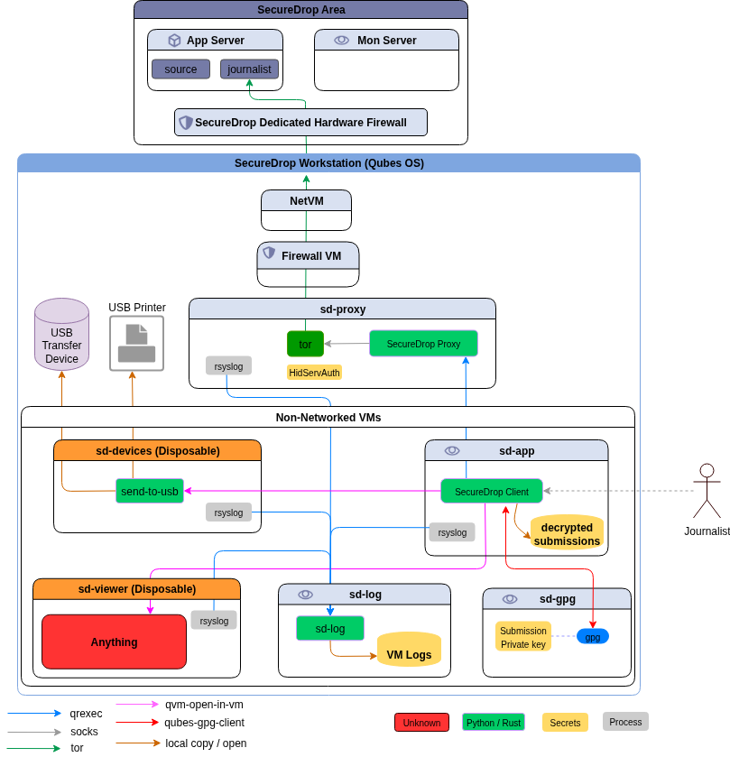

> By [contributing](https://developers.securedrop.org/en/latest/contributing.html) to this project, you agree to abide by our [Code of Conduct](https://github.com/freedomofpress/.github/blob/main/CODE_OF_CONDUCT.md).

## Bringing SecureDrop to Qubes

This project aims to improve journalists' experience using SecureDrop, by moving the journalist workflow to a single computer running multiple virtual machines with [Qubes OS](https://qubes-os.org). Data is moved as automatically and transparently as possible between otherwise isolated VMs.

We are currently piloting this project with a small number of news organizations; see [our blog post](https://securedrop.org/news/piloting-securedrop-workstation-qubes-os/) for additional information.

1. [Detailed Rationale](#detailed-rationale)
1. [Project Status](#project-status)
1. [Architecture](#architecture)
1. [What's In This Repo?](#whats-in-this-repo)
1. [Installation](#installation)
1. [Threat model](#threat-model)

## Detailed Rationale

SecureDrop's [architecture](https://docs.securedrop.org/en/latest/overview.html#infrastructure) and [threat model](https://docs.securedrop.org/en/stable/threat_model/threat_model.html) are proven, but the current approach also has major drawbacks:

- Journalists must access a separate, airgapped device to even validate that a submission is relevant. The airgapped workflow is complex and slow, and may reduce the reliance on SecureDrop overall.

- The complexity of the setup and the usage procedures create operational security risks. For example, journalists may accidentally boot up the wrong device using the _Secure Viewing Station_ (SVS) USB drive, breaking the airgap, or they may attempt "workarounds" to shortcut the laborious process of checking for submissions.

- Applying security updates to the SVS is difficult, which may cause administrators to wait a long time before doing so. While the SVS is airgapped, an insecure SVS still exposes additional vectors of attack, especially since the journalist is by design opening unknown files on the workstation.

- Once a document has been decrypted on the SVS, a journalist is more or less on their own right now. Work on the submission and the collaboration with other journalists are "not our department". Yet, security failures are likely during this stage. It's difficult to address this fundamental issue with the current workflow, since the SVS is essentially a dead end as far as SecureDrop is concerned.

The Qubes OS approach addresses this at multiple levels:

- By disabling Internet access and [mitigating against other exfiltration risks](https://en.wikipedia.org/wiki/Air_gap_malware) on a per-VM basis, we can combine multiple functions into a single device. Checking SecureDrop submissions is as simple as booting up your workstation, downloading recent submissions, and inspecting them. This has the potential to greatly reduce time and effort spent by SecureDrop journalists, administators and trainers, and to increase day-to-day SecureDrop use.

- Qubes OS' security model lets us add specific software features (such as document redaction, or sanitization via [Dangerzone](https://dangerzone.rocks)) with careful consideration in each case what level of system or network access an application requires. This lets us gradually extend the functionality we can offer to journalists beyond the mere download of submissions.

- We can potentially add VMs that enable end-to-end encrypted communication with other SecureDrop journalists, intermediated by the SecureDrop server. This enables us to add software features that, for example, let journalists collaborate in categorizing submissions, assigning work, versioning changes to documents, and so on.

However, the Qubes OS approach is not without downsides. It stands and falls with the security of Qubes OS itself, which in turn may be impacted by Spectre/Meltdown type CPU level vulnerabilities, hypervisor vulnerabilities, and so on. These risks must be compared against the operational security risks of the current architecture, including the work that journalists do after downloading a submission. The Qubes OS website provides a useful [comparison of its security model with that of using a separate machine](https://www.qubes-os.org/faq/#how-does-qubes-os-compare-to-using-a-separate-physical-machine).

## Project status

We intend to bring the pilot program to a close in 2024, and move forward with general availability of SecureDrop Workstation following final updates based on the pilot participants' feedback and experience. The general availability version will be compatible with Qubes 4.2. Work is ongoing on 4.2 compatibility, and the mainline of this repo will be in flux and not suitable for production deployment until the work is completed and audited.

For now, if you want to preview SecureDrop Workstation's functionality we recommend following the installation instructions at [https://workstation.securedrop.org](https://workstation.securedrop.org), which will guide you through installing the latest stable version of SecureDrop Workstation on Qubes 4.1.

## Architecture

The current architecture replaces the *Journalist Workstation* and *Secure Viewing Station* Tails installations with specially-configured Qubes VMs; these are the VMs the user will primarily interact with. There are a number of other configured VMs which provide ancillary services.

Currently, the following VMs are provisioned:

- `sd-proxy` is where the SecureDrop proxy resides, which allows the non-networked `sd-app` vm to communicate with the *Journalist Interface* over Tor.
- `sd-app` is a non-networked VM in which the *SecureDrop Client* runs used to store and explore submissions after they're unarchived and decrypted. Any files opened in this VM are opened in a disposable VM.
- `sd-whonix` is the Tor gateway used to contact the journalist Tor hidden service. It's configured with the auth key for the hidden service. The default Qubes Whonix workstation uses the non-SecureDrop Whonix gateway, and thus won't be able to access the *Journalist Interface*.
- `sd-gpg` is a Qubes split-gpg AppVM, used to hold submission decryption keys and do the actual submission crypto.
- `sd-viewer` is an AppVM used as the template for the disposable VMs used for processing and opening files.
- `sd-log` is an AppVM used for centralized logging - logs will appear in `~/QubesIncomingLogs` from each AppVM using the centralized logging service.

Submissions are processed in the following steps:

1. Journalist uses the *SecureDrop Client* to access the *Journalist Interface* via the Journalist API. After logging in, the journalist clicks
on any submission of interest.
2. The *SecureDrop Client* will use `sd-gpg` to decrypt the submission using Qubes' split-GPG functionality (decryption is done in a trusted, isolated VM, keeping GPG keys off of the system-wide DispVM).
5. The decrypted submission is stored on the `sd-app` *Secure Viewing Station VM*, where it's placed in a local database.
6. Any file opened by the *SecureDrop Client* in the *Secure Viewing Station VM* is opened in a Disposable VM, largely mitigating attacks from malicious content.

See below for a closer examination of this process, and see `docs/images` for screenshots related to the steps above.

## What's In This Repo?

This repository contains the material needed to provision the base Qubes system with the VMs and files required to support
SecureDrop Workstation.

Provisioning is accomplished by installing an .rpm in dom0 on a fresh installation of QubesOS, configuring instance-specific
secrets and credentials, then running an orchestration command (`sdw-admin --apply`) which configures the machine
in the desired state.

This repository contains the following core components:

- `securedrop_salt`, which contains all files required during the provisioning (orchestration) stage. Qubes uses SaltStack internally for VM provisionining and configuration management (see https://www.qubes-os.org/doc/salt/). The contents of `securedrop_salt` are provisioned to end users via the securedrop-workstatoin-dom0-config RPM.
- `files`, which contain scripts and configuration files placed in dom0 before provisioning, such as systemd units, [RPC policy files](https://www.qubes-os.org/news/2020/06/22/new-qrexec-policy-system/#policy-files), and Python scripts. The contents of `files` are provisioned to end users via the securedrop-workstatoin-dom0-config RPM.
- the "pre-flight updater" components (`launcher`, `sdw_updater`, `sdw_notify`, `sdw_util`), which comprise a wrapper around the Qubes Updater, and which serve to enforce a fully-patched system. The contents of these directories are provisioned to end users via the securedrop-workstation-dom0-config RPM. The updater updates all TemplateVMs relevant to the SecureDrop Workstation prior to use, and the the `sdw-notify.py` script reminds the user to update the system if they have not done so recently.

This repo also contains the following developer-facing components:
- `rpm-build`, containing the components required for building the `securedrop-workstation-dom0-config` RPM that is ultimately published to our [yum repository](https://yum.securedrop.org).
- `scripts`, which are developer-facing linting and build-related scripts.
- `Makefile` is used with the `make` command on `dom0` to build the Qubes/SecureDrop installation, and also contains some development and testing features.

SecureDrop Workstation has a companion repository, [SecureDrop Client](https://github.com/freedomofpress/securedrop-client/),
that contains component code for all of the packages we ship in individual VMs once they have been provisioned:
- The [SecureDrop Client](https://github.com/freedomofpress/securedrop-client/tree/main/client#readme) is installed in `sd-app` and will be used to access the SecureDrop server *Journalist Interface* via the SecureDrop proxy.
- The [SecureDrop Proxy](https://github.com/freedomofpress/securedrop-client/tree/main/proxy#readme) is installed in `sd-proxy` to communicate to the SecureDrop server *Journalist Interface* via `sd-whonix`.
- [SecureDrop Export](https://github.com/freedomofpress/securedrop-client/tree/main/export#readme) is installed in `sd-devices` and is used to manage printing and exporting files.
- The *SecureDrop Client* opens all submissions in the networkless, disposable `sd-viewer` VM
- A logging VM, `sd-log`, is provisioned to capture logs locally from various parts of the system
- A [Whonix](https://www.whonix.org/wiki/Homepage) VM, `sd-whonix`, is provisioned with instance-specific information required to access the authenticated onion service used by journalists.

### Additional Notes:

- `files/config.json.example` is an example config file for the provisioning process. Before use, you should rename a copy `config.json` (in the repository's root directory), then edit `config.json` to reflect your environment.
- `sd-journalist.sec.example` is an example private key for use in decrypting submissions in test/development environments. **This keypair must not be used in a production environment.** Use your own armored [Submission Private Key](https://workstation.securedrop.org/en/stable/admin/install.html#copy-the-submission-key) file, named as `sd-journalist.sec`, to provision SecureDrop Workstation.

## Installation

Installing this project is involved. It requires an up-to-date Qubes 4.2 installation running on a machine with at least 16GB of RAM (32 GB recommended).

**The project is currently in a closed beta, and we do not recommend installing it for production purposes independently. See our [blog post](https://securedrop.org/news/piloting-securedrop-workstation-qubes-os/) for more information. If you are participating in our beta program, please consult our *[end user documentation](https://workstation.securedrop.org)* for detailed setup instructions, and do not hesitate to reach out for assistance.**

To install a development version (using test data on the server and a test encryption key to decrypt it), in summary, you will need to:

1. Ensure you have an up-to-date SecureDrop server or staging environment
2. Apply all available system updates in Qubes OS
3. Clone this repository into a development VM
4. In the development VM, install Podman, Docker or another OCI compatible container engine (the build environment depends on it)
5. Create a `config.json` and `sd-journalist.sec` (Submission Private Key) appropriate for your environment
6. Copy the contents from your development VM into `~/securedrop-workstation` in `dom0`
7. In `dom0`, export `SECUREDROP_DEV_VM` (name of your dev VM) and `SECUREDROP_DEV_DIR` (full path to repo checkout in dev VM) and run `make clone`
8. Run `make dev` in `dom0` to provision a development environment.

This is only a summary; see our *[developer documentation](http://developers.securedrop.org/en/latest/workstation_setup.html)* for detailed instructions.

## Threat model

This section outlines the threat model for the *SecureDrop Workstation*, and should complement [SecureDrop's threat model](https://docs.securedrop.org/en/stable/threat_model/threat_model.html). This document is always a work in progress, if you have any questions or comments, please open an issue on [GitHub](https://github.com/freedomofpress/securedrop-workstation) or send an email to [securedrop@freedom.press](mailto:securedrop@freedom.press).

### Assumptions

#### Assumptions About the SecureDrop Servers

* The SecureDrop *Application* and *Monitor* servers are properly installed and configured.
* Operational security, administration and usage of the SecureDrop instance follows the guidance provided by the SecureDrop documentation.

#### Assumptions About the *Securedrop Workstation* Install

* *SecureDrop Workstation* was installed correctly
* Updates are applied to *SecureDrop Workstation* provisioning code, VM templates and `dom0` as they are available.

#### Assumptions About the World

* The security assumptions of dm-crypt and LUKS are valid.
* The security assumptions of Tor, the Hidden Service protocol and Hidden Service authentication are valid.
* The security assumptions of RSA are valid.
* The security assumptions of the Qubes operating system are valid.
* The security assumptions of the Xen hypervisor are valid.

### Attack Scenarios

As the *SecureDrop Workstation* is not Internet-reachable, an attacker must first obtain code execution on a virtual machine. This can be achieved through a malicious SecureDrop submission, websites visited by a journalist or a vulnerability in the provisioning code and its dependencies. The Virtual Machine in which the adversary obtains code execution will dictate what information is potentially compromised, as well as the attack surface exposed for lateral movement or escalation of privilege.

#### What Compromise of the *Display VM* (`sd-viewer`) Can Achieve

The *Display VM* (sd-viewer) is disposable, does not have network access, and is used to display only one submission before being destroyed.

* An adversary can read the decrypted submission.
* An adversary can attempt to elevate their privileges and escape the VM.
* An adversary can attempt to communicate through a side channel to another VM or device in the *SecureDrop Workstation's* environment.
* An adversary can exhaust storage in the centralized logging VM (`sd-log`).

#### What Compromise of the *Proxy VM* (`sd-proxy`) Can Achieve

* An adversary can intercept and modify any and all communication between the Tor Browser and the SecureDrop *Journalist Interface*, including but not limited to:
  * Send messages to (but not view messages from) sources.
  * Delete messages and submissions.
  * Access encrypted messages and submissions.
  * Access plaintext journalist passwords to the *Journalist Interface*.
* An adversary can attempt to elevate their privileges and escape the VM.
* An adversary can exhaust storage in the centralized logging VM (`sd-log`).

#### What Compromise of the *Whonix Gateway VM* (`sd-whonix`) Can Achieve

* An adversary can obtain the *Journalist Interface's* ATHS cookie.
* An adversary can intercept and modify any and all communication between the Proxy VM and the SecureDrop *Journalist Interface*, including but not limited to:
  * Send messages to sources (but not view messages from a source).
  * Delete messages and submissions.
  * Access encrypted messages and submissions.
  * Access plaintext journalist passwords to the *Journalist Interface*.
* An adversary can attempt to elevate their privileges and escape the VM.

#### What compromise of the *App VM* (`sd-app`) can achieve
The *App VM* is where securedrop-client resides. It does not have network access, and the Qubes split-gpg mechanism permits access to GPG keys from this VM.
* An adversary can view all decrypted submissions.
* An adversary can decrypt arbitrary encrypted submissions.
* An adversary can interact with the SecureDrop *Journalist Interface* or modify SecureDrop client code.
* An adversary can attempt to elevate their privileges and escape the VM.
* An adversary can exhaust storage in the centralized logging VM (`sd-log`).

#### What Compromise of the *GPG VM* (`sd-gpg`) Can Achieve

The *GPG VM* does not have network access, and the Qubes split-gpg mechanism restricts access to this VM per the Qubes GPG RPC policy.

* An adversary can decrypt and encrypted message or submission.
* An adversary can store and view any message that is being decrypted by the *SecureDrop Workstation*.
* An adversary can attempt to elevate their privileges and escape the VM.

#### What Compromise of the *Log VM* (`sd-log`) Can Achieve

The *Log VM* does not have network access nor does it contain any other secrets.

* An adversary can read log messages from any VM using the centralized logging service.
* An adversary can tamper with log messages from any VM using the centralized logging service.
* An adversary can attempt to elevate their privileges and escape the VM.

#### What Compromise of `dom0` Can Achieve

`dom0` can do all of the above: spawn arbitrary virtual machines, access all data, modify all *SecureDrop Workstation* provisioning code, as well as introduce mechanisms to establish persistence and exfiltrate data. By design, Qubes' `dom0` does not have network access, files cannot be copied to `dom0`, and clipboard sharing is disabled.
